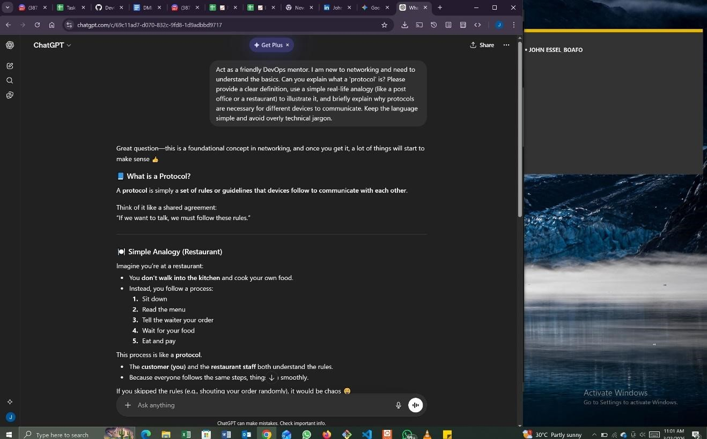
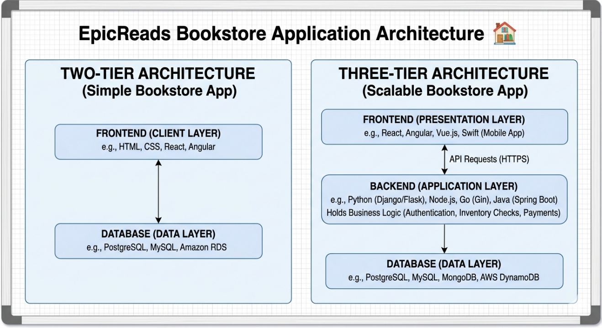
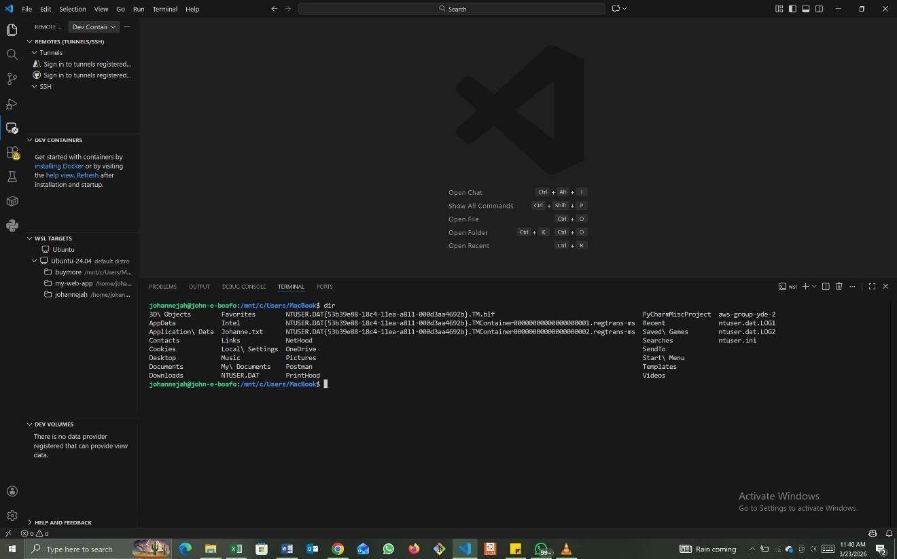

# Week 00 - Internet and Networking

Part of the DevOps Micro Internship (DMI) Cohort 3 with Agentic AI

---

# 🧑‍💻 Task 1: Using ChatGPT as Your Learning Assistant

## Scenario

You're new to DevOps and will frequently encounter technical questions. ChatGPT can be your learning companion.

## Your Task

Write a clear ChatGPT prompt to help you understand:

> "What is a protocol in networking? Explain with a simple real-life example."

Take a screenshot of your interaction showing:

* Your detailed prompt (with clear expectations)
* ChatGPT's simplified response with an example

## Screenshot

Save your screenshot in the `screenshots` folder and update the file name below.



---

## What I Learned (2–3 lines)

From this task, I learned that a protocol acts as the essential "social etiquette" for the digital world, ensuring that diverse devices can communicate without chaos. By using the restaurant analogy, I now see that networking isn't just about cables and signals, but about a structured, step-by-step agreement that guarantees data reaches its destination in a readable and reliable format.

---

# 🌐 Task 2: Internet and Networking

## Scenario

Your friend is launching an online bookstore named **EpicReads**.

He asked you to explain how users globally can access his website hosted in Finland.

## Your Task

Write a short explanation (**100–150 words**) that includes:

* Packet Switching
* IP Address
* TCP/IP
* HTTP/HTTPS

💡 **Tip:** You may use ChatGPT (as demonstrated in Task 1) to refine your explanation.

## Answer

To understand how the internet functions, think of it as a massive, high-speed postal system governed by a set of universal rules called TCP/IP. This foundational suite of protocols ensures that different devices can "speak" the same language across the globe.
When you access a website, your data is broken down into small, manageable chunks known as Packet Switching. Instead of sending one massive file, these packets take the most efficient routes across various routers to reach their destination. To ensure they arrive at the right place, every device is assigned a unique IP Address, acting much like a digital home address.
Finally, your web browser uses HTTP (Hypertext Transfer Protocol) to request and receive webpage data. For security, HTTPS adds a layer of encryption, ensuring that the "conversation" between your computer and the server remains private and tamper-proof.

---

# 🏗️ Task 3: Application Architecture & Stack

## Scenario

EpicReads bookstore has two application versions:

### Two-Tier Application

* Frontend
* Database

### Three-Tier Application

* Frontend
* Backend
* Database

## Your Task

* Draw simple diagrams (hand-drawn or tool-based such as draw.io)
* Label each layer clearly
* List at least two common technologies or tools used for each layer
* Submit a screenshot or photo clearly showing your own drawing

## Diagram Screenshot / Photo

Save your diagram image in the `screenshots` folder and update the file name below.



---

## Technologies Used

### Frontend

* Mobile Technologies: Flutter, React Native, Swift (iOS), or Kotlin (Android).
* Web Technologies: React, Angular, Vue.js, or plain HTML/CSS/JavaScript.

### Backend

* Programming Languages & Frameworks: Python (Django/Flask), JavaScript (Node.js/Express), Java (Spring Boot), or Go.
* API Protocols: REST, GraphQL, or gRPC (used for the Frontend to talk to the Backend).

### Database

* Relational Databases (SQL): PostgreSQL, MySQL, or Microsoft SQL Server.
* Cloud/NoSQL Databases: MongoDB, Amazon DynamoDB, or Amazon RDS.

---

# 🌍 Task 4: Domain Name & DNS (Basic Concepts)

## Scenario

Your friend's bookstore **EpicReads** is currently accessible through:

```text
52.172.142.222:3000
```

He purchased the domain:

```text
epicreads.com
```

## Your Task

In **50–100 words**, explain in your own words:

1. What is DNS (Domain Name System)?
2. Which DNS record type should be used to connect the domain to the given IP, and why?

## Answer

Think of DNS (Domain Name System) as the "phonebook" of the internet. While computers communicate using numerical IP addresses (like 52.172.142.222), humans find it much easier to remember names like epicreads.com. DNS translates those human-friendly names into the machine-readable numbers needed to locate a specific server.
To connect EpicReads to its server, you should use an A Record (Address Record). This specific record type maps a domain name directly to an IPv4 address. By configuring this, any customer typing the domain into their browser will be automatically directed to the correct server IP and port.

---

# 💻 Task 5: Visual Studio Code Setup (Hands-on)

## Your Task

Install Visual Studio Code (if not already installed).

Take a screenshot of your VS Code environment showing:

* Terminal open inside VS Code
* Running a basic command:

### Windows

```powershell
dir
```

### Linux / macOS

```bash
pwd
ls
```

* Your selected VS Code theme clearly visible

⚠️ **Important:** The screenshot must show your username or another identifiable detail to confirm it is your environment.

## Screenshot

Save your screenshot in the `screenshots` folder and update the file name below.



---

# 🔗 Task 6: Publish Your Assignment as a LinkedIn Post

## Objective

Publishing on LinkedIn helps you:

* Build your professional online presence
* Reinforce your learning
* Document your DevOps journey publicly

## Your Task

Summarize your answers from Tasks 1–5 into a LinkedIn post.

Clearly structure your post into the following sections:

* ChatGPT
* Internet & Networking
* App Architecture
* DNS
* VS Code Setup

Add the following credit note at the end of your post:

> **P.S. This post is a part of DevOps Micro Internship with Agentic AI Cohort-3 by Pravin Mishra. You can start your DevOps journey by joining this Discord community: https://discord.pravinmishra.com/**

---

## LinkedIn Post URL

Paste your LinkedIn post URL here:

https://www.linkedin.com/posts/john-essel-boafo-4ab79555_epic-reads-shop-young-adult-ya-books-share-7441830093540241408-BKie/?utm_source=share&utm_medium=member_desktop&rcm=ACoAAAuvIYMB9Ryolxl8KsPVg0BaN-tpeQW214U

---

## LinkedIn Post Backup Copy

Paste the full text of your LinkedIn post here:

From Managing People to Managing Systems: Bridging HR Strategy with DevOps & Cloud Security.
I’ve officially kicked off my adventure into the world of DevOps and Cloud Security. This week, I’ve been diving deep into the foundational "plumbing" of the internet to understand how modern applications actually work.
Here’s a quick recap of what I’ve mastered so far:
ChatGPT
ChatGPT as a Learning Assistant I’ve learned that the secret to rapid learning is in the prompt. By treating AI as a "Technical Mentor" and asking for real-world analogies (like comparing networking protocols to a restaurant's workflow), complex concepts become much easier to digest.
Internet & Networking Essentials 
The internet isn't magic; it's a series of agreements. I explored Packet Switching, where data is broken into small chunks to travel the most efficient paths, and the TCP/IP suite, which acts as the universal language for all connected devices.
App Architecture 
2-Tier vs. 3-Tier I analyzed the architecture for a digital bookstore, EpicReads. While a 2-tier system is simple, moving to a 3-Tier Architecture (Frontend ↔️ Backend ↔️ Database) is the gold standard for security and scalability—crucial for any Cloud Security professional!
DNS
The Internet’s Phonebook No one wants to memorize an IP address like 52.172.142.222. I learned how the Domain Name System (DNS) translates human-friendly names like epicreads.com into machine-readable IPs using A Records.
VS Code Setup 
I’ve optimized my workstation by setting up Visual Studio Code, the industry-standard editor. With the right extensions, it’s not just a text editor; it’s a powerful command center for writing code and managing cloud infrastructure.
This is just the beginning of my journey toward AWS and Cloud Security excellence!
#DevOps #CloudSecurity #AWS #TechTransition #ContinuousLearning #NetworkingBasics

P.S. This post is part of the FREE DevOps Micro Internship Cohort run by Pravin Mishra. You can start your DevOps journey for free from his YouTube Playlist.

---

# Reflection – Week 0

### What did you find easy?

I found using ChatGPT as a learning assistant and creating real-world analogies (like the restaurant protocol) to be very intuitive, as they bridge the gap between complex tech and everyday logic.

---

### What was difficult?

Visualizing the flow of Packet Switching and the specific distinctions between 2-Tier and 3-Tier architectures required more focus to ensure I understood how security is managed at each layer.

---

### What will you improve next week?

Next week, I plan to spend more time practicing with VS Code extensions and terminal commands to build the "muscle memory" needed for efficient cloud infrastructure management.

---

## 📌 About DMI & CloudAdvisory

DevOps Micro Internship (DMI) is a project-based DevOps program run by Pravin Mishra (The CloudAdvisory) focused on real-world execution, systems thinking, and career readiness.

It helps learners build strong DevOps foundations with hands-on experience.


## 📌 Resources

- 🌐 **DMI Official Website:** https://pravinmishra.com/dmi  
- 🎓 **DevOps for Beginners (Udemy):** https://www.udemy.com/course/devops-for-beginners-docker-k8s-cloud-cicd-4-projects/  
- 🎓 **Ultimate Agentic AI DevOps with Clude Code** https://www.udemy.com/course/ultimate-agentic-ai-devops-with-claude-code/?referralCode=448389767BC96284087B
- 🎓 **DevOps with Claude Code: Terraform, EKS, ArgoCD & Helm** https://www.udemy.com/course/devops-with-claude-code-terraform-eks-argocd-helm/?referralCode=1C5B734505D65A010FA3
- ▶️ **YouTube Playlist (DMI Cohort 3):** https://www.youtube.com/playlist?list=PLFeSNDtI4Cho  
- 🔗 **Pravin Mishra (LinkedIn):** https://www.linkedin.com/in/pravin-mishra-aws-trainer/  
- 🏢 **CloudAdvisory (LinkedIn):** https://www.linkedin.com/company/thecloudadvisory/

---

*This submission is part of DevOps Micro Internship (DMI) Cohort 3 — Agentic AI Track*