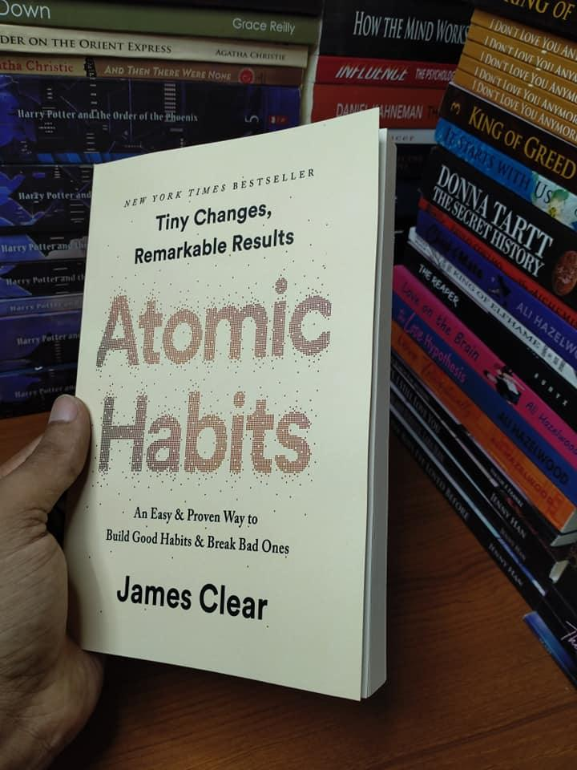

# Week 01 — Success Mindset (Mindset OS)

Part of the DevOps Micro Internship (DMI) Cohort 3 with Agentic AI

---

## Purpose (Read This First)

This week is not motivation homework.

This is you building your **Mindset OS** — the system you will use for the next 5 months (and honestly, for years).

### Expectations

* Be honest.
* Be specific.
* Be practical.
* Write like an adult professional: clear sentences, no one-liners.

You will reuse this in later weeks. So do it properly once.

---

# Assignment 1. What is something you believe to be true that most people around you would disagree with?

### Rules

* No "safe" answers.
* Must be your real belief (not copied from internet).
* Minimum 50 words.

**Hint:** What do you believe about career, money, learning, discipline, relationships, health, success, life, tech industry, etc. that most people don't agree with?

## Answer

Most people learning DevOps believe that success lies in mastering the maximum number of tools—building an endless list of certifications across Docker, Kubernetes, Jenkins, and AWS. I strongly disagree with this approach.

I believe that over-focusing on tools is a trap that actually slows down real expertise. DevOps is not a collection of software; it is a philosophy of empathy, communication, and system efficiency. A great engineer doesn't just know how to write a Kubernetes configuration; they understand why the development and operations teams are failing to communicate in the first place. If you don't master the underlying systems thinking, culture, and problem-solving methodologies, you are simply a tool-operator, not a DevOps practitioner. The best way to learn is to focus on the human and architectural bottlenecks first, then use the tools as a secondary means to solve them. True mastery is tool-agnostic.

---

# Assignment 2. What are the top 3 objective truths you discovered through experimentation and results?

### Definition

Objective truths do not depend on opinions. They hold true regardless of how people feel.

Write each truth in this format:

**Truth:** (1 sentence)

**Evidence from my life:** (2–4 lines: what you tried + what happened)

---

## Truth #1

### Truth

Consistent, structured daily repetition builds technical execution skills faster than passive concept absorption.

### Evidence from my life

When trying to master technical concepts like cloud architectures and network security, reading documentation left me with abstract understanding but high execution anxiety. Once I pivoted to building actual hands-on projects, executing terminal commands, and deliberately troubleshooting configuration failures daily, my technical confidence transformed into measurable engineering capabilities.

---

## Truth #2

### Truth

Skills that are not actively forced to adapt to real-world friction rapidly atrophy.

### Evidence from my life

I noticed that passing technical certifications gave me a temporary wave of knowledge, but that knowledge began to fade within weeks if left dormant. Only by immediately applying those concepts to live lab environments, breaking configurations on purpose, and building actual cloud infrastructure did the skills permanently stick.

---

## Truth #3

### Truth

Complex, stable systems are invariably built by starting with small, functioning systems and iterating outward.

### Evidence from my life

Attempting to architect a massive, fully automated multi-service infrastructure from scratch all at once always led to overwhelming configuration errors that were impossible to debug. By scaling down my approach, first deploying a single running service, then containerizing it, and finally layering on orchestration, the overall architecture remained stable and manageable.

---

# Assignment 3. What does your 2.0 version look like?

### Instructions

Write as if a journalist is writing about you **3 to 7 years from now** (not 20 years).

**Minimum 300 words.**

### Rules

* Write in past tense, like it already happened.
* Don't use "likes to / wants to / hopes to."
* Use specifics:

  * built
  * shipped
  * led
  * published
  * earned
  * relocated
  * contributed
* Include skills proof:

  * projects
  * portfolios
  * GitHub
  * blogs
  * certifications
  * job role
  * leadership
  * community contribution
* Add 1–3 images if you can (optional but powerful).

### Publish It Publicly On Any ONE

* LinkedIn
* Medium
* WordPress
* Blogspot
* Personal blog
* Portfolio page

Include this line:

> **P.S. This post is a part of DevOps Micro Internship with Agentic AI Cohort-3 by [Pravin Mishra](https://www.linkedin.com/in/pravin-mishra-aws-trainer/). You can start your DevOps journey by joining this [Discord community](https://discord.pravinmishra.com/) ( https://discord.pravinmishra.com/ ).**

## Your Article

Add your answer here...
What if you could open a magazine a few years from now and read a major profile on your professional achievements?

Not a summary of where you stand at this moment, but a reflection of the engineer that your daily routines, discipline, and grit are actively moulding you into.

For this week’s DevOps Micro Internship (DMI) assignment, we were pushed to confront a powerful prompt: Designing our “Version 2.0.” The challenge required us to adopt the lens of a tech journalist looking back on our career path a few years down the line. This wasn’t an exercise in daydreaming — it was an intentional blueprint of the technical trajectory we are actively choosing to construct.

So, here’s my Version 2.0.

When John Essel-Boafo joined the DevOps Micro Internship (DMI) Cohort 3 on June 27, 2026, he wasn’t a typical entry-level applicant. He arrived with a Master of Business Administration in Human Resource Administration, a strong background in sociology and economics, and years of experience managing complex operational site logistics and rigorous labour compliance audits. However, the world of cloud infrastructure, automated continuous integration pipelines, and container environments was a brand-new landscape.

Rather than trying to hide his non-traditional background, John weaponized it. He realised that the human dynamics, organisational systems, and strict compliance frameworks he mastered in his business career were the exact missing ingredients needed to build world-class tech architecture. He dove straight into the deep end — spinning up Linux environments, building Docker images, and designing cloud networks. Instead of just following basic video tutorials, he forced himself into the terminal every single day, deliberately breaking deployment environments so he could master the art of fixing them.

Within three years, that systematic discipline paid off. John stepped into the tech space as a Senior DevOps and Cloud Security Architect. He successfully engineered and shipped high-availability infrastructure deployments, highlighted by an open-source security framework that used the AWS SDK to programmatically pull credentials from AWS Secrets Manager — completely eliminating hardcoded passwords in production code. His production-ready projects on GitHub gained rapid traction, and advanced technical credentials like the AWS Certified DevOps Engineer — Professional validated the deep expertise he built through hands-on laboratory execution.

Beyond his engineering output, John became widely known for his unique technical writing style. Remembering how steep the technical learning curve felt, he dedicated his Medium publication to breaking down complex cloud concepts using vivid, real-world analogies. Whether comparing Kubernetes clusters to automated shipping docks or explaining the AWS SDK as an armoured delivery truck, his articles demystified engineering for thousands of readers and became essential reading for professionals making their own career transitions.

His leadership naturally extended into the community. John returned to his engineering roots in Ghana, transitioning from an eager learner into a core coordinator and mentor within the AWS Accra User Group, actively helping the next generation of African tech talent clear technical roadblocks.

Looking back, joining DMI Cohort 3 was the ultimate inflection point that bridged his past operational expertise with his future technical mastery. His journey shattered the myth that you have to start from zero to enter tech, proving instead that an engineering career is built on systems thinking, regular execution, and the courage to show up daily.

Whether this story reads like a vision or a future biography, one thing is certain: every skill I learn, every project I build, and every challenge I embrace from today brings me one step closer to becoming this version of myself.

P.S. This post is a part of DevOps Micro Internship with Agentic AI Cohort-3 by Pravin Mishra. You can start your DevOps journey by joining this Discord community.
### Public Link

Paste your link here:

`https://medium.com/@johannejah/what-would-a-journalist-write-about-your-career-three-years-from-now-542d80c56487?sharedUserId=johannejah`

---

# Assignment 4. Have you ever cut corners (unethical / dishonest / shortcut behavior — not necessarily illegal)? If yes, how did it make you feel?

### Important

You don't need to write the full story.

Focus on the feeling:

* guilt
* fear
* shame
* stress
* regret
* numbness
* etc.

This is about self-awareness, not judgment.

### Answer Format

**Yes**

If Yes:

**What emotion did you feel?** (minimum 50–100 words)

## Answer

Choosing to take a shortcut instead of doing the work properly immediately triggered a heavy wave of anxiety and stress. While it saved a bit of time upfront, it left me with a constant fear that the flaws would be discovered. Instead of feeling good about finishing quickly, I felt guilty and worried about the compromised quality of the work. It became exhausting to carry that pressure, and I deeply regretted not just putting in the honest, disciplined effort to do it right from the start.

---

# Assignment 5. What are 10 non-fiction books you plan to read in the next 1 year?

### Rules

* Mention **Title + Author**
* Any language allowed
* No fiction novels

### Tip

Choose books that improve:

* mindset
* communication
* productivity
* health
* money
* career
* leadership

## Book List

1. Atomic Habits by James Clear

2. The 5am Club by Robin Sharma
3. Extreme Ownership: How U.S. Navy SEALs Lead and Win by Jocko Willink and Leif Babin
4. The Psychology of Money: Timeless Lessons on Wealth, Greed, and Happiness by Morgan House
5. Outlive: The Science and Art of Longevity by Peter Attia, MD
6. Deep Work: Rules for Focused Success in a Distracted World by Cal Newport
7. Never Split the Difference: Negotiating As If Your Life Depended On It by Chris Voss
8. The Laws of Human Nature by Robert Greene
9. The Phoenix Project: A Novel About IT, DevOps, and Helping Your Business Win by Gene Kim, Kevin Behr, and George Spafford
10. The DevOps Handbook: How to Create World-Class Agility, Reliability, and Security in Technology Organizations by Gene Kim, Jez Humble, Patrick Debois, and John Willis

---

# Assignment 6. What are the things you will measure regularly in your life and career?

### Rules

List topics only. No need to share numbers.

### Must Include

* Learning / skill
* Output / proof
* Health / energy
* Time / focus
* Money / finance (personal or business)

### Example

* Learning hours per week
* Deep work sessions per week
* Projects shipped / documented
* Steps / workouts
* Sleep hours
* Spending tracker

## My Metrics

* Personal monthly budgeting, savings percentage, and income-to-expense ratios.
* Weekly physical exercise routines and active workout sessions.
* Technical breakthrough blogs or architectural analogy articles published on Medium monthly.
* Capital growth tracking and risk management parameters for personal financial accounts.
* Cloud security or architectural documentation modules reviewed weekly.
* Metric tracking monthly investments made into career capital, including cloud sandboxes, professional training platforms, and laboratory infrastructure.
* Daily monitoring of resting heart rate and stress-recovery balance scores.
* Count of technical mock exam practice sets and certification question reviews completed per week.
* Total number of structural architecture diagrams designed and added to public project documentation.
* Weekly tracking of hours dedicated to active community engagement, project reviews, and mentorship inside the AWS Accra User Group and DMI.

---

# Assignment 7. Brain Dump + 5-Month System Plan

## Step 1: Brain Dump (Private)

Do a brain dump of everything in your mind into a notebook.

Examples:

* Bills
* Tasks
* Worries
* Goals
* Pending messages
* Ideas
* Responsibilities

### Did You Do It?

**Yes / No**

Answer:

Yes.

---

## Step 2: Your 5-Month Routine + Focus Blocks

Create a simple plan you can realistically follow for the next 5 months.

### Weekly Routine

Example:

* Mon–Thu: 60 min deep work
* Sat: DMI session
* Sun: Weekly review

#### My Weekly Routine

* Monday – Friday: 90 minutes of dedicated, uninterrupted technical focus (Hands-on terminal execution, lab architecture deployments, and Python scripts).
* Saturday: DMI Session, technical cohort engagement, and updating laboratory documentation.
* Sunday: Weekly professional review, checking data tracking metrics, organizing upcoming labour compliance documentation, and scheduling the week's Medium analogies.

---

### Focus Blocks

#### When Will You Do DMI Work? (Days + Time)

Review and preparation on Sunday. Monday to Friday from 8:00 PM to 9:30 PM.

#### How Many Sessions Per Week?

6 dedicated sessions per week (5 weekday evening deep-work blocks + 1 primary Sunday session).

---

### Distraction Rules

Examples:

* Phone rules
* Social media rules
* Environment setup

#### My Distraction Rules

* The phone is placed completely out of sight in another room or inside a drawer on "Do Not Disturb" during the 90-minute evening engineering block.
* All social media notifications and alerts are muted.
* Clear desk policy with only the primary laptop, a notebook for structural architecture.

---

# Reflection – Week 1

### Biggest insight I got about myself this week

My biggest insight is realizing that I possess a strong capacity for structured execution when I intentionally bridge my deep operational background with my technical engineering goals. I discovered that treating my personal growth and career pivot as an architectural project, complete with clear blueprints and defined system rules, completely changes my engagement level and gives me the confidence to build a solid "Version 2.0" identity.

### My biggest weakness/loop I noticed

The biggest loop I noticed is the temptation to seek immediate tactical progress or shortcuts when facing complex technical challenges, rather than embracing the slower, disciplined pace required for deep, foundational mastery. This quick-fix approach creates internal friction and anxiety about the structural integrity of my learning, showing me that skipping steps ultimately yields negative operational leverage.

### One system I will implement from this week (exact habit + time)

I will implement a strict 90-minute technical focus block every Monday through Friday from 8:00 PM to 9:30 PM. During this exact window, my phone will be placed in another room on "Do Not Disturb," and I will operate entirely within a dedicated desktop engineering profile to focus exclusively on hands-on terminal execution and system automation architectures.Add your answer here.

### LinkedIn Post

Paste your LinkedIn post link here:

**https://www.linkedin.com/posts/john-essel-boafo-4ab79555_what-would-a-journalist-write-about-your-share-7478653776858398720-KcKV/?utm_source=share&utm_medium=member_desktop&rcm=ACoAAAuvIYMB9Ryolxl8KsPVg0BaN-tpeQW214U**

---

## 10. Proof of Work

- LinkedIn Post URL: **https://www.linkedin.com/posts/john-essel-boafo-4ab79555_what-would-a-journalist-write-about-your-share-7478653776858398720-KcKV/?utm_source=share&utm_medium=member_desktop&rcm=ACoAAAuvIYMB9Ryolxl8KsPVg0BaN-tpeQW214U**  
- Blog / Medium : **https://medium.com/@johannejah/what-would-a-journalist-write-about-your-career-three-years-from-now-542d80c56487?sharedUserId=johannejah**  

---

## 📌 About DMI & CloudAdvisory

DevOps Micro Internship (DMI) is a project-based DevOps program run by Pravin Mishra (The CloudAdvisory) focused on real-world execution, systems thinking, and career readiness.

It helps learners build strong DevOps foundations with hands-on experience.

## 📌 Resources

- 🌐 **DMI Official Website:** https://pravinmishra.com/dmi  
- 🎓 **DevOps for Beginners (Udemy):** https://www.udemy.com/course/devops-for-beginners-docker-k8s-cloud-cicd-4-projects/  
- 🎓 **Ultimate Agentic AI DevOps with Clude Code** https://www.udemy.com/course/ultimate-agentic-ai-devops-with-claude-code/?referralCode=448389767BC96284087B
- 🎓 **DevOps with Claude Code: Terraform, EKS, ArgoCD & Helm** https://www.udemy.com/course/devops-with-claude-code-terraform-eks-argocd-helm/?referralCode=1C5B734505D65A010FA3
- ▶️ **YouTube Playlist (DMI Cohort 3):** https://www.youtube.com/playlist?list=PLFeSNDtI4Cho  
- 🔗 **Pravin Mishra (LinkedIn):** https://www.linkedin.com/in/pravin-mishra-aws-trainer/  
- 🏢 **CloudAdvisory (LinkedIn):** https://www.linkedin.com/company/thecloudadvisory/

---

*This submission is part of DevOps Micro Internship (DMI) Cohort 3 — Agentic AI Track*