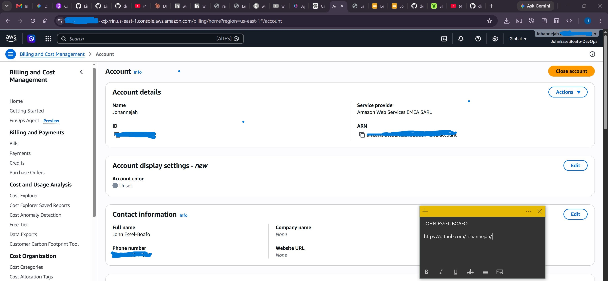

# Assignment 1 — AWS Free Tier Account Setup (EpicReads Cloud Onboarding)

Part of the DevOps Micro Internship (DMI) Cohort 3 with Agentic AI

---

## Purpose

In this assignment, you will create and verify an AWS Free Tier account as part of onboarding EpicReads — an online bookstore moving to the cloud. You will demonstrate an understanding of AWS fundamentals, Free Tier services, and account setup by answering conceptual questions and capturing proof of a working AWS Console login.

---

# Task 1 — Understanding AWS & Free Tier

## Goal

Demonstrate understanding of AWS basics and Free Tier usage by answering the following questions in your own words (3–4 lines each).

### Answers

#### Question 1 — What is an AWS account, and why do you need it at this stage?

An AWS account acts as a secure, isolated tenant boundary that grants access to Amazon's vast suite of cloud resources, billing structures, and security controls. At this early stage of onboarding EpicReads, having a dedicated account is crucial to establish a sandboxed environment where we can safely configure identity access, explore Free Tier services, and design a foundational, secure infrastructure without impacting active workloads or incurring unnecessary costs.

---

#### Question 2 — What is AWS Free Tier, and how long does it last?

The AWS Free Tier is a program designed to let users explore and gain hands-on experience with cloud services at no cost. Its duration depends on the specific offer type: "Always Free" services have no expiration date (within monthly usage limits), while standard 12-Month Free offers expire one year after signup. Additionally, under the latest AWS model, new accounts can choose a 6-Month Free Plan utilizing up to $200 in promotional trial credits, or a Paid Plan where the free credits expire after 12 months.

---

#### Question 3 — Name three AWS Free Tier services and their free usage limits.

1. Amazon EC2 (Elastic Compute Cloud): Under the 12-Month Free Tier, 750 hours per month of t2.micro or t3.micro instance usage (depending on your region).

2. Amazon S3 (Simple Storage Service): Under the 12-Month Free Tier, 5 GB of standard object storage.

3. Amazon DynamoDB: Under the Always Free tier, 25 GB of NoSQL database storage.

---

# Task 2 — Create AWS Free Tier Account

## Goal

Create a valid AWS Free Tier account and sign in to the AWS Management Console.

> No screenshots required for this task. Completion is verified through Task 3.

---

# Task 3 — Verify AWS Account

## Goal

Confirm that your AWS account setup is complete by navigating to the Account section and capturing proof.

### Evidence

#### Screenshot 1 — AWS Account page showing account name (email may be blurred)

---

# Submission Instructions

- Add all required screenshots in your GitHub repository submission
- Full name must be visible in required screenshots
- Do not expose sensitive information (keys, passwords, account IDs)

---

# Completion Checklist

- [ ] Task 1 answers written in own words
- [ ] AWS Free Tier account created successfully
- [ ] Signed in to AWS Management Console
- [ ] Screenshot of AWS Account page captured (full name visible, no sensitive data)
- [ ] All required screenshots added to repository

---

## 📌 About DMI & CloudAdvisory

DevOps Micro Internship (DMI) is a project-based DevOps program run by Pravin Mishra (The CloudAdvisory) focused on real-world execution, systems thinking, and career readiness.

It helps learners build strong DevOps foundations with hands-on experience.

---

## 📌 Resources

- 🌐 DMI Official Website: https://pravinmishra.com/dmi  
- 🎓 DevOps for Beginners (Udemy): https://www.udemy.com/course/devops-for-beginners-docker-k8s-cloud-cicd-4-projects/  
- 🎓 Agentic AI DevOps with Claude Code: https://www.udemy.com/course/ultimate-agentic-ai-devops-with-claude-code/  
- 🎓 DevOps with Claude Code: Terraform, EKS, ArgoCD & Helm: https://www.udemy.com/course/devops-with-claude-code-terraform-eks-argocd-helm/  
- ▶️ YouTube Playlist: https://www.youtube.com/playlist?list=PLFeSNDtI4Cho  
- 🔗 Pravin Mishra (LinkedIn): https://www.linkedin.com/in/pravin-mishra-aws-trainer/  
- 🏢 CloudAdvisory (LinkedIn): https://www.linkedin.com/company/thecloudadvisory/

---

*This submission is part of DevOps Micro Internship (DMI) Cohort 3 — Agentic AI Track.*