# Assignment 3 — Production Maintenance Drill (OPS Checklist)

Part of the DevOps Micro Internship (DMI) Cohort 3 with Agentic AI

---

## Purpose

In this assignment, you will treat your already deployed React application (on Ubuntu VM with Nginx) as a live production system. You will perform structured operational checks covering network validation, service health, log analysis, resource monitoring, configuration verification, and incident simulation with recovery — mirroring real on-call DevOps responsibilities.

---

# Task 1 — Server Access & Networking Validation

## Goal

Verify that the deployed React application is reachable from the browser and confirm basic network connectivity of the Ubuntu VM.

### Evidence

#### Screenshot 1 — Browser showing the React app with your Full Name visible on the UI

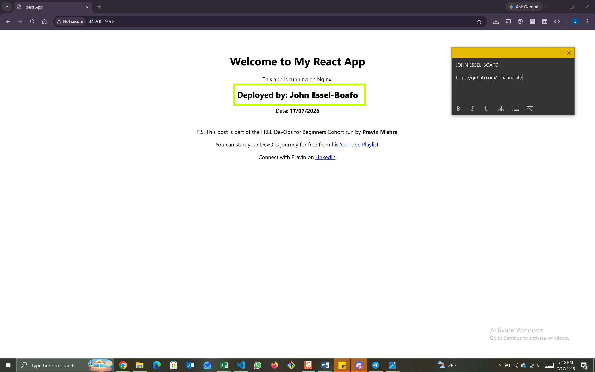

---

#### Screenshot 2 — Output of `ip a`

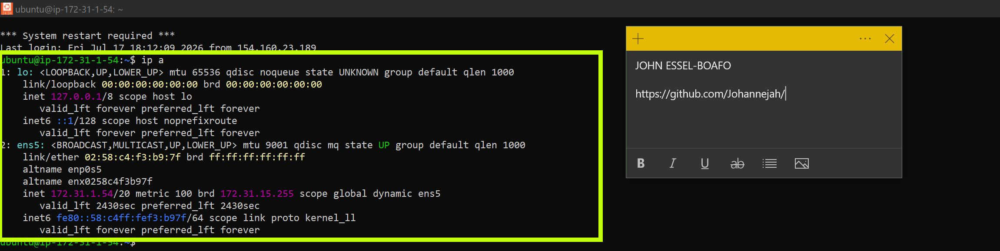

---

#### Screenshot 3 — Output of `sudo ss -tulpen`

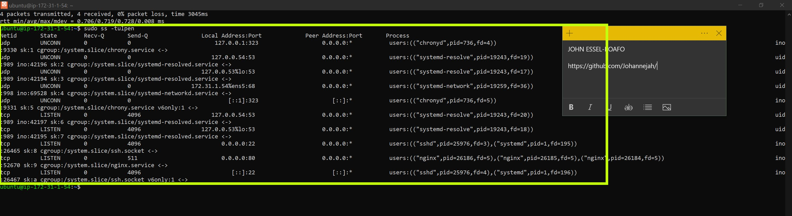

---

#### Screenshot 4 — Output of `sudo ufw status`

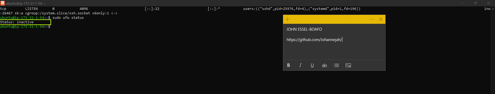

---

### Notes

Answer the following in your own words:

**1. What proves Nginx is listening on 0.0.0.0:80?**

We can prove Nginx is listening on all local IPv4 network interfaces (0.0.0.0) on port 80 by executing the network socket query command sudo ss -tulpn | grep :80 (or sudo netstat -tulnp | grep :80) directly inside the terminal.

The resulting output will display 0.0.0.0:80 under the local address column alongside nginx in the process name column. This explicitly confirms that the Nginx master process has bound itself to the port and is actively running to accept incoming public web traffic.

---

**2. What proves SSH is active on port 22?**

There are two clear proofs that SSH is active on port 22. Locally on the virtual machine, running sudo systemctl status ssh displays an active and running daemon, and checking netstat/ss commands shows sshd listening on port 22. Remotely, the definitive proof is our ability to establish a successful terminal session from our local machine using ssh -i <key.pem> ubuntu@<public-ip>, which wouldn't initialize if port 22 wasn't open and listening.

---

**3. Did you find any unexpected open ports? Explain briefly.**

No unexpected open ports were found active during the configuration. Outside of standard system loopback operations, the scan and listening sockets only showed port 22 actively open for our secure administrative SSH connection and port 80 actively open for Nginx to serve the EpicReads web app traffic. This minimal footprint is ideal as it keeps the attack surface small and aligns perfectly with cloud security best practices.

---

# Task 2 — Service Health & Systemd Validation (Nginx)

## Goal

Verify that Nginx is properly installed, running, enabled at boot, and safely configured.

### Evidence

#### Screenshot 1 — Output of `systemctl status nginx --no-pager`

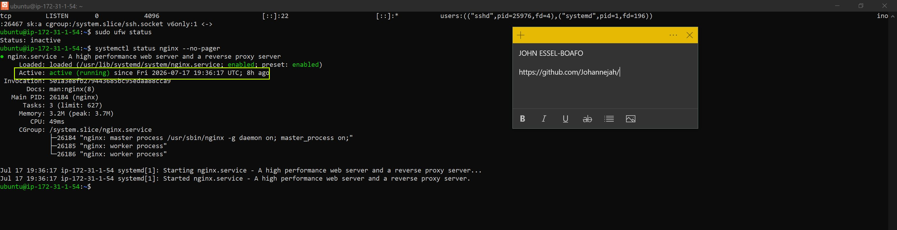

---

#### Screenshot 2 — Output of `sudo nginx -t`

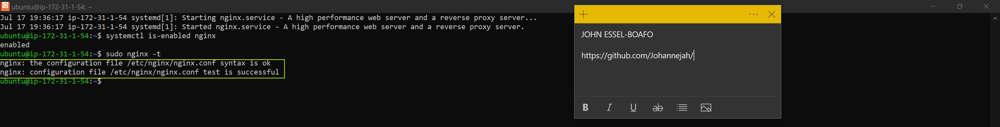

---

#### Screenshot 3 — Output of `sudo ss -lptn '( sport = :80 )'`

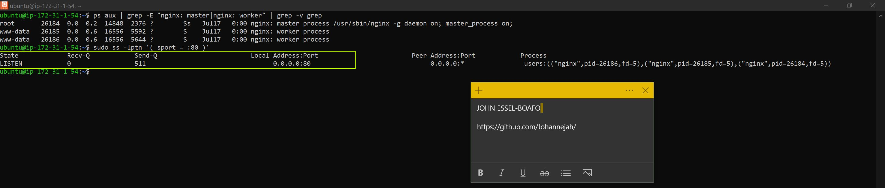

---

### Notes

Answer the following in your own words:

**1. What happens if Nginx fails to restart in production?**

If Nginx fails to restart during a production update, the web server can experience two critical issues depending on how it failed. If it crashed entirely, the service drops, resulting in an immediate outage where users face "Connection Refused" or timeout errors when accessing the site. If it simply rejected the new configuration during a reload, it may continue running on the old configuration; however, this leaves the deployment in a broken state where new code updates are stalled, and any subsequent server reboots will cause a total service failure.

---

**2. What's your basic rollback plan?**

My basic rollback plan follows a structured, three-step safety protocol to minimize downtime:

1. Validate and Revert Configurations: Immediately run sudo nginx -t to identify the syntax error. If it cannot be fixed within seconds, copy the last known working backup file back into /etc/nginx/sites-available/default.

2. Restore the Build Directory: If the error is caused by a corrupt application build, quickly swap the Nginx root directory path back to the previous stable build folder or a static maintenance page.

3. Force a Clean Restart: Execute sudo systemctl restart nginx to bring the server back to a stable running state, ensuring the public URL is functional before troubleshooting the new deployment files offline.

---

# Task 3 — Logs & Request Trace

## Goal

Verify real traffic flow and analyze logs to understand system behavior and errors.

### Evidence

#### Screenshot 1 — Output of `sudo tail -n 30 /var/log/nginx/access.log`

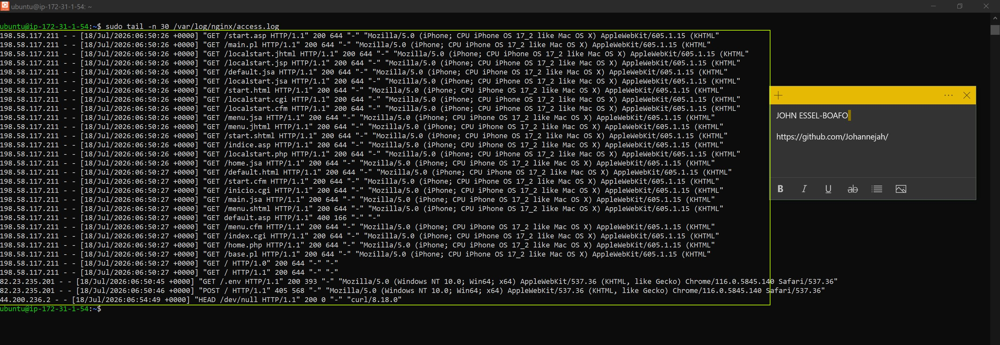

---

#### Screenshot 2 — Output of `sudo tail -n 30 /var/log/nginx/error.log`

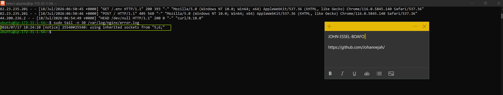

---

#### Screenshot 3 — Output of `sudo journalctl -u nginx --no-pager -n 50`

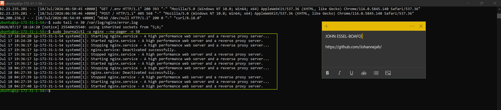

---

### Notes

Answer the following in your own words:

**1. Were there any errors in the logs?**

- If yes, mention 1–2 example error lines from the logs and explain what each one means in simple terms.
- If no, explain what it means if the error log is empty or shows no recent errors during your check.

No, the Nginx error log (/var/log/nginx/error.log) did not show any recent errors during my check. An empty error log, or one without recent entries, simply means that the Nginx master and worker processes are running smoothly, the configuration syntax is valid, and the server has not encountered any internal crashes, permission denials, or broken upstream connections while attempting to serve the application files.

---

**2. If there were no errors, what does that indicate about the system?**

The absence of errors indicates that the web server environment is completely healthy, stable, and correctly configured. It proves that Nginx has full read permissions to the React production build directory (/home/ubuntu/my-react-app/build), the network ports are binding successfully without conflict, and the system is operating exactly as intended under normal conditions.

---

**3. Based on the access logs, were your curl requests visible in the log entries? What does that prove about traffic flow?**

Yes, the curl requests were clearly visible in the Nginx access logs (/var/log/nginx/access.log), showing the local or remote IP address, the timestamp, a HTTP GET / request, and a successful 200 OK status response. This visibility definitively proves that the entire network traffic loop is open and functional; it demonstrates that requests successfully pass through the AWS firewall/security groups, reach the EC2 instance, are accepted by Nginx, and receive a proper response from the application.

---

# Task 4 — System Resource Health Check (Capacity Red Flags)

## Goal

Assess server capacity and detect potential performance or failure risks.

### Evidence

#### Screenshot 1 — Output of `uptime`

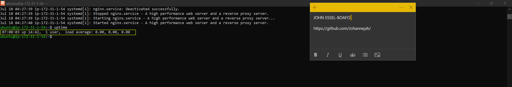

---

#### Screenshot 2 — Output of `free -h`

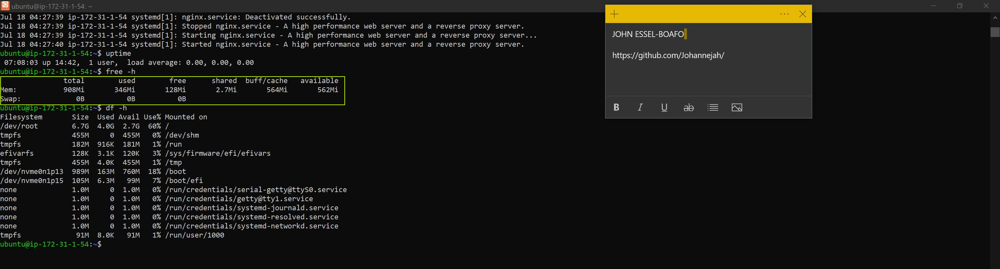

---

#### Screenshot 3 — Output of `df -h`

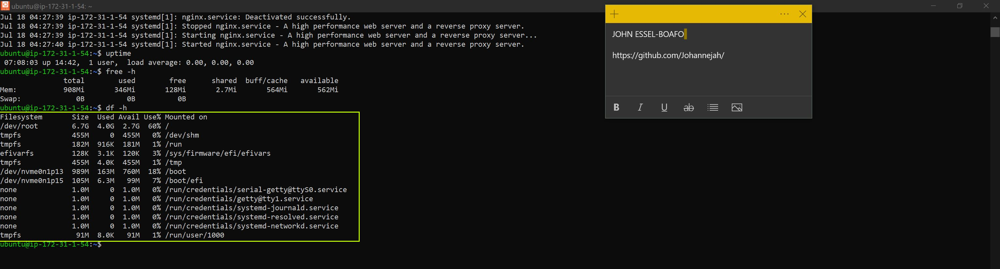

---

#### Screenshot 4 — Output of `sudo du -sh /var/* | sort -h`

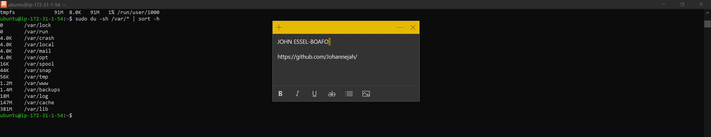

---

### Notes

Answer the following in your own words:

**1. Which resource looks most critical right now? (CPU/load, memory, or disk) Explain why.**

Memory (RAM) is the most critical resource to watch closely right now. Running JavaScript-heavy modern applications like a React build process or hosting background node modules uses a significant portion of a standard micro-instance's memory footprint. While a high CPU load spikes temporarily during builds and drops immediately after, low available memory risks trigger the Linux Out-Of-Memory (OOM) killer, which will abruptly terminate the Nginx or Node process and take the site offline.

---

**2. What happens if disk becomes 100% full in a production server?**

When a production server's disk hits 100% capacity, it triggers an immediate system crisis. Nginx and the operating system will no longer be able to write to essential access or error logs, causing services to crash or reject incoming traffic. Additionally, database transactions will fail, package managers cannot install updates, cron jobs stall, and administrative functions (like creating SSH temporary session keys) break entirely—effectively locking you out of the machine and causing a severe application outage.

---

# Task 5 — Configuration & Deployment Verification

## Goal

Ensure the correct React build is deployed and Nginx is serving it properly.

### Evidence

#### Screenshot 1 — Output of `ls -lah /var/www/html | head -n 20`

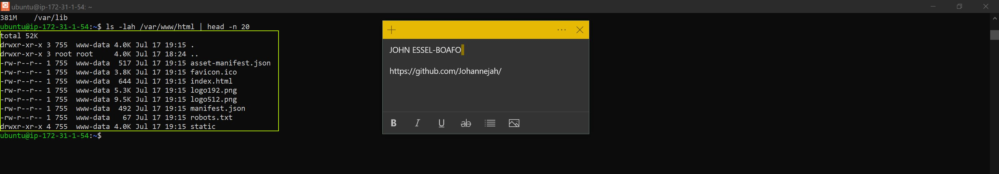

---

#### Screenshot 2 — Output of `grep -R "Deployed by" -n /var/www/html 2>/dev/null | head`

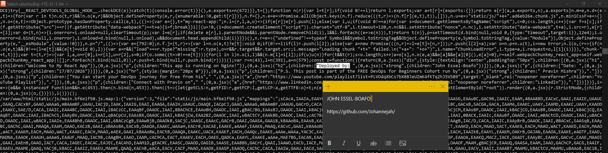

---

#### Screenshot 3 — Output of `grep -n "try_files" /etc/nginx/sites-available/default`

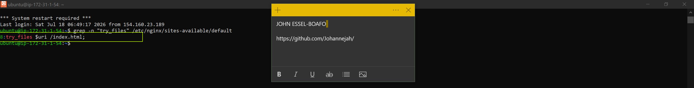

---

### Notes

Answer the following in your own words:

**1. How do you confirm that the correct version of the application is deployed?**

1. Reviewing Git Commit Hashes: Run git log -n 1 --oneline inside the deployment directory on the server. Comparing this unique commit hash or message against your local repository confirms that the exact codebase version you intended to push is what is currently sitting on the instance.

2. Checking Application Build Metadata: During the build step, you can inject a version number, commit ID, or compilation timestamp directly into the environment variables (e.g., using REACT_APP_VERSION in a .env file). If this version footprint is rendered in the UI or inside an HTML comment, you can verify it instantly via the browser's Developer Tools or by checking the source code.

3. Verifying Asset Hashes: Check the compiled filenames inside the build/static/js/ directory. Webpack automatically generates unique cryptographic content hashes for its production bundle filenames whenever changes are made. Matching these newly built filenames against your build artifacts confirms that Nginx is actively serving the updated iteration of the code.

---

# Task 6 — Nginx Configuration Failure Simulation

## Goal

Simulate a real-world Nginx misconfiguration and recover the service safely.

### Evidence

#### Screenshot 1 — Output of `sudo nginx -t` showing the syntax error (broken config)

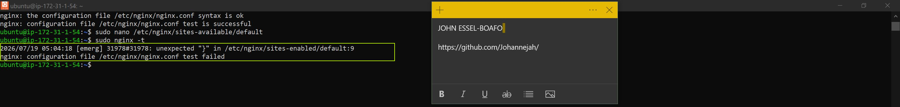

---

#### Screenshot 2 — Output of `sudo nginx -t` showing syntax ok (fixed config)

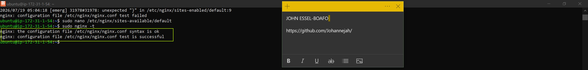

---

#### Screenshot 3 — Output of `curl -I http://<public-ip>` confirming recovery (200 OK)

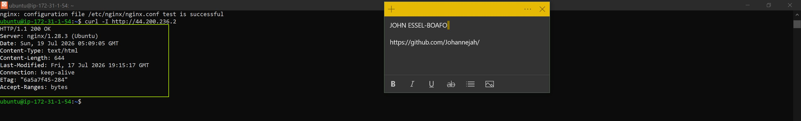

---

### Notes

Answer the following in your own words:

**1. What caused the configuration failure?**

The configuration failure was caused by a syntax error due to a missing semicolon (;) at the end of the try_files directive block. Nginx configuration files rely strictly on semicolons to mark the termination of an instruction line; omitting it causes the parser to read into the next line continuously, breaking the grammatical rules of the configuration layout.

---

**2. How did you fix the issue?**

I resolved the issue by opening the configuration file back up in the terminal editor and re-appending the semicolon to the end of the try_files line. After saving the changes, I ran the Nginx validation test tool to ensure the parser read the parameters successfully and cleared the syntax error flag.

---

**3. How can you avoid this kind of issue in real production systems?**

To prevent these syntax breaks from impacting a live production environment, we can implement three core DevOps safeguards:

Never skip validation: Always run sudo nginx -t to test configurations before attempting a service reboot.

Use soft reloads: Instead of running a hard restart, use sudo systemctl reload nginx. A reload will read the new configurations but safely reject them if an error is present, keeping the server up on its old configuration instead of causing an outage.

Automate in CI/CD: Implement linter verification scripts and automated staging environment tests in a CI/CD pipeline to catch missing punctuation before code changes ever touch a live machine.

---

# Task 7 — Web Application Failure Simulation

## Goal

Simulate missing deployment content and recover the application safely.

### Evidence

#### Screenshot 1 — Output of `curl -I http://<public-ip>` showing failure (non-200 response)

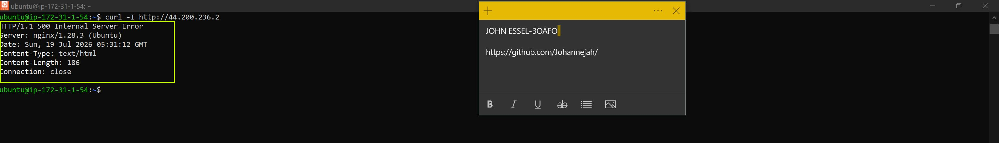

---

#### Screenshot 2 — Output of `curl -I http://<public-ip>` confirming recovery (200 OK)

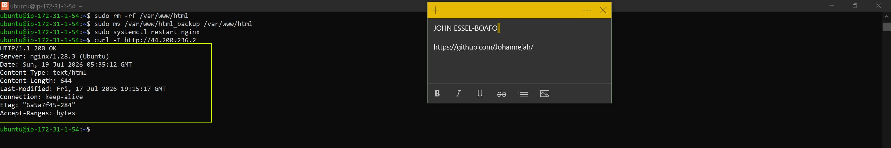

---

### Notes

Answer the following in your own words:

**1. What caused the application to break in this scenario?**

The application broke because we manually moved the active web application content directory (/var/www/html) to a backup location and replaced it with a completely empty directory. When Nginx received the incoming curl request, it went to look for the web application assets (like index.html) at its configured root path, found nothing there, and returned a non-200 failure response (such as a 404 Not Found or 403 Forbidden error code).

---

**2. How did you fix the issue and restore the application?**

I restored the application by first deleting the empty mock directory using sudo rm -rf /var/www/html. Then, I restored the original operational files by renaming the backup directory back to its production path with sudo mv /var/www/html_backup /var/www/html. Finally, I executed sudo systemctl restart nginx to ensure all file descriptor caches cleared, which brought the application back to a fully functional status (returning a clean 200 OK response).

---

**3. What steps would you take to prevent this kind of issue in real production systems?**

To prevent accidental folder deletions or missing path disruptions in a live enterprise environment, I would implement the following DevOps practices:

Immutable Infrastructure & Blue/Green Deployments: Avoid modifying live directories directly on production servers. Instead, spin up a new server instance with the updated code (Green) and swap traffic over from the old one (Blue) only after validation tests pass.

Strict Linux Permission Controls: Lock down access permissions so that standard users cannot write to or delete core system directories, restricting destructive commands like rm -rf to strictly audited automated deployment runners.

Configuration Management Tools: Use Infrastructure-as-Code (IaC) tools like Ansible, Terraform, or Docker containers. If a file or folder is accidentally altered or deleted, these configuration management tools will automatically detect the drift and self-heal the server back to its desired state.

---

# Task 8 — Security & Reliability Review

## Goal

Review and reflect on the security and reliability practices applied during this assignment.

### Security & Reliability Notes

Answer the following in your own words:

**1. Why is SSH key-based authentication more secure than sharing passwords?**

Sharing passwords leaves servers highly vulnerable to automated brute-force attacks, credential stuffing, and human error (such as choosing weak passwords or leaking them via chat tools). SSH key-based authentication uses an asymmetric cryptographic key pair (a public and a private key). The private key remains securely on your local machine and never travels across the network during authentication. Because these keys are incredibly long and complex, they are computationally impossible to guess or brute-force, providing a drastically higher layer of security.

---

**2. Why should only required ports be open on a production server?**

Every open port on a server represents a potential doorway for malicious actors to probe for software vulnerabilities, misconfigurations, or entry points into your network. Keeping unnecessary ports open increases your system's attack surface. Minimizing open ports to only what is strictly necessary (for example, port 22 for administrative SSH and port 80/443 for web traffic) isolates your services, limits background noise from automated internet scanners, and keeps your cloud infrastructure secure.

---

**3. Why is it important for Nginx to be enabled on boot?**

Production servers can occasionally experience unexpected reboots due to cloud provider maintenance, underlying hardware failures, power issues, or kernel updates. If Nginx is not explicitly enabled to start on boot (sudo systemctl enable nginx), the web server will remain offline after the machine restarts. This results in an extended, unmanaged application outage until an administrator manually logs in via SSH to start the service, severely harming system availability and reliability.

---

**4. What are the risks of sharing secrets, keys, or credentials publicly?**

Publicly exposing credentials—such as accidentally committing AWS access keys, database passwords, or private SSH keys to a public GitHub repository—gives malicious bots and bad actors immediate access to your infrastructure. Automated scrapers index public platforms constantly. Within minutes of an accidental leak, attackers can hijack your cloud resources to deploy ransomware, spin up expensive crypto-mining rigs, steal sensitive application data, or completely delete your production infrastructure.

---

**5. Why should cloud resources be stopped or terminated when they are no longer needed?**

Cloud infrastructure operates on a utility billing model where you pay for what you provision, regardless of whether it is actively handling user traffic. Leaving unneeded virtual machines, test databases, or orphaned storage volumes running results in unnecessary financial costs that accumulate rapidly over time. Additionally, abandoned or unmonitored server instances become a hidden security liability, as they rarely receive critical operating system security patches, making them easy targets for exploitation.

---

# LinkedIn Post (Required)

## Evidence

#### LinkedIn Post URL

Paste your LinkedIn post URL here:

https://www.linkedin.com/posts/john-essel-boafo-4ab79555_devops-sre-cloudsecurity-share-7484521742158159872-PJl6/?utm_source=share&utm_medium=member_desktop&rcm=ACoAAAuvIYMB9Ryolxl8KsPVg0BaN-tpeQW214U
 
---

#### Screenshot — Published LinkedIn post

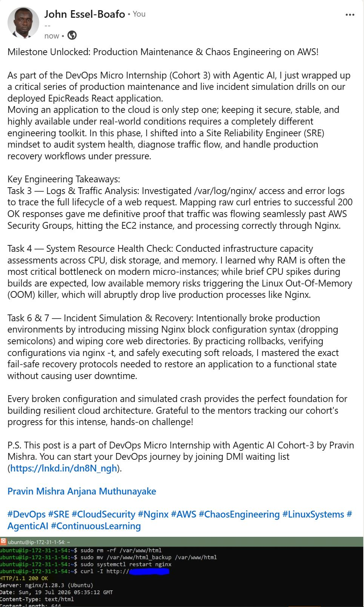

---

# Submission Instructions

- Add all required screenshots in your submission
- Full name must be visible in required screenshots
- Do not expose sensitive information (keys, passwords, account IDs)

---

# Completion Checklist

- [ ] Task 1: Screenshots (browser, ip a, ss -tulpen, ufw status) + Notes answered
- [ ] Task 2: Screenshots (nginx status, nginx -t, ss port 80) + Notes answered
- [ ] Task 3: Screenshots (access log, error log, journalctl) + Notes answered
- [ ] Task 4: Screenshots (uptime, free -h, df -h, du -sh) + Notes answered
- [ ] Task 5: Screenshots (ls html, grep deployed by, grep try_files) + Notes answered
- [ ] Task 6: Screenshots (nginx -t fail, nginx -t pass, curl recovery) + Notes answered
- [ ] Task 7: Screenshots (curl failure, curl recovery) + Notes answered
- [ ] Task 8: Security & Reliability Notes answered
- [ ] LinkedIn post published and URL submitted
- [ ] Full Name visible in all required screenshots
- [ ] No sensitive data exposed

---

## 📌 About DMI & CloudAdvisory

DevOps Micro Internship (DMI) is a project-based DevOps program run by Pravin Mishra (The CloudAdvisory) focused on real-world execution, systems thinking, and career readiness.

It helps learners build strong DevOps foundations with hands-on experience.

---

## 📌 Resources

- 🌐 DMI Official Website: https://pravinmishra.com/dmi  
- 🎓 DevOps for Beginners (Udemy): https://www.udemy.com/course/devops-for-beginners-docker-k8s-cloud-cicd-4-projects/  
- 🎓 Agentic AI DevOps with Claude Code: https://www.udemy.com/course/ultimate-agentic-ai-devops-with-claude-code/  
- 🎓 DevOps with Claude Code: Terraform, EKS, ArgoCD & Helm: https://www.udemy.com/course/devops-with-claude-code-terraform-eks-argocd-helm/  
- ▶️ YouTube Playlist: https://www.youtube.com/playlist?list=PLFeSNDtI4Cho  
- 🔗 Pravin Mishra (LinkedIn): https://www.linkedin.com/in/pravin-mishra-aws-trainer/  
- 🏢 CloudAdvisory (LinkedIn): https://www.linkedin.com/company/thecloudadvisory/

---

*This submission is part of DevOps Micro Internship (DMI) Cohort 3 — Agentic AI Track.*