# Assignment 5 — Bash Script Automation Drill (OPS Checklist)

Part of the DevOps Micro Internship (DMI) Cohort 3 with Agentic AI

---

## Purpose

In this assignment, you will practice Bash scripting by building a series of small automation scripts covering environment setup, variables, arrays, loops, file conditionals, if-else logic, and functions. These scripts form the foundation of real-world Linux automation used in DevOps, cloud, and production support environments.

---

# Task 1 — Bash Environment & Workspace Setup

## Goal

Verify that Bash is available on your system and create a clean workspace for this assignment.

### Evidence

#### Screenshot 1 — Output of `echo $SHELL` and `bash --version`

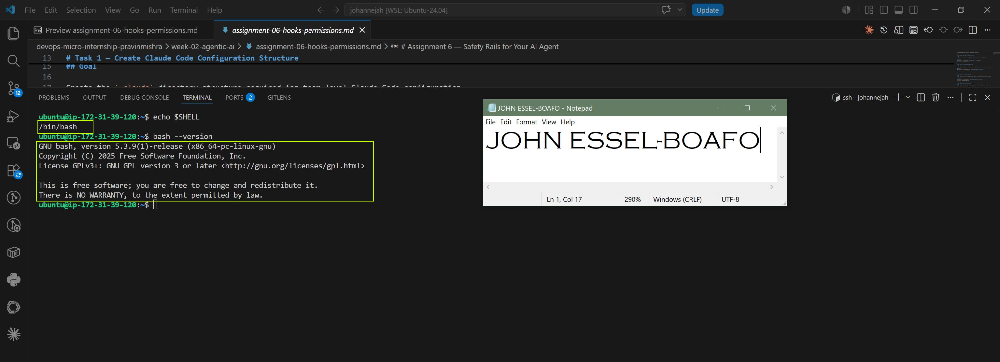

---

#### Screenshot 2 — Output of `pwd` and `ls -lah` showing the scripts directory

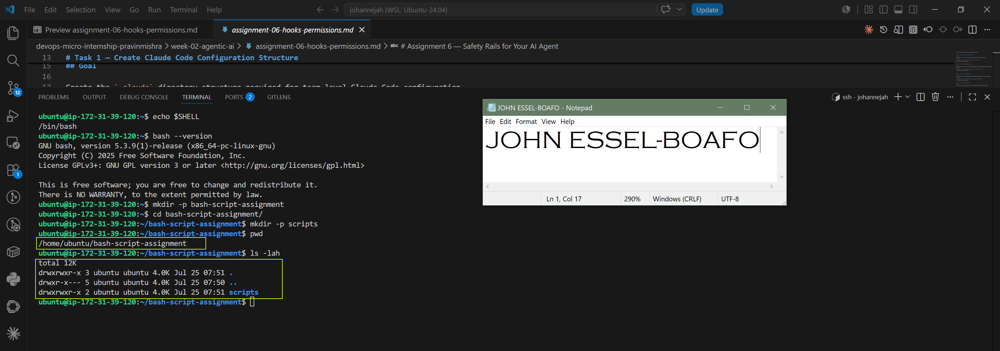

---

### Notes

Answer the following in your own words:

**1. What is Bash?**

Bash (Bourne Again Shell) is a text-based command-line interpreter and scripting language used to interact directly with a computer's operating system. Instead of clicking icons, you type commands to manage files, configure programs, and navigate directories. In modern cloud engineering and DevOps, it is the fundamental tool used to automate server tasks, write deployment scripts, and manage virtual machines without a graphical interface.

---

**2. What is the difference between shell and Bash?**

A shell is the general category of software that interprets command-line text inputs to run programs on an operating system. Bash (Bourne Again Shell) is simply one specific, highly popular version of a shell that serves as the default standard on most Linux systems.

---

**3. Why is it important to confirm the Bash version before writing scripts?**

Confirming the Bash version before writing scripts is crucial because different versions support different features and syntax rules. If you use newer language features (like associative arrays or advanced string manipulation) in a script deployed to an older server, the script will crash or behave unpredictably.

Checking the version beforehand ensures cross-platform compatibility and prevents syntax errors across different production environments.

---

# Task 2 — Your First Bash Script

## Goal

Create your first Bash script, make it executable, and run it from the terminal.

### Evidence

#### Screenshot 1 — Content of `first-script.sh`

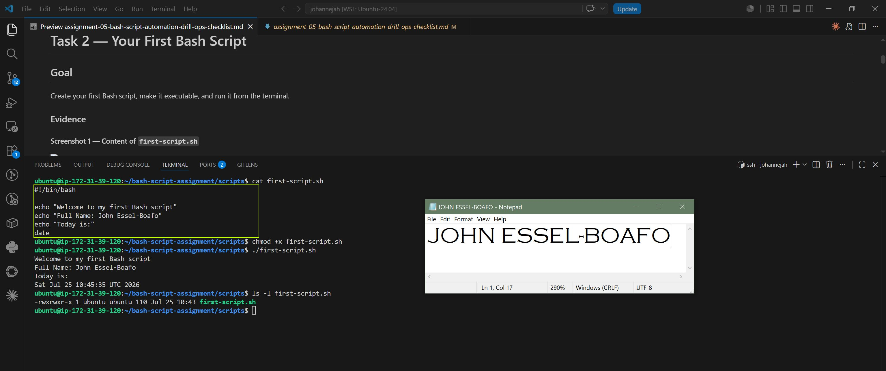

---

#### Screenshot 2 — Output of `./first-script.sh`

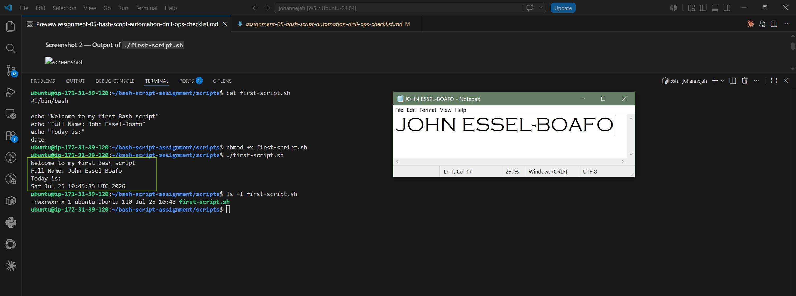

---

#### Screenshot 3 — Output of `ls -l first-script.sh` showing executable permission

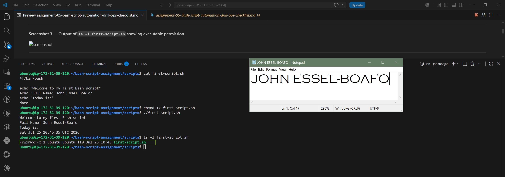

---

### Notes

Answer the following in your own words:

**1. What is the purpose of `#!/bin/bash`?**

The #!/bin/bash line at the very top of a script file is called a shebang.

Its absolute purpose is to tell the operating system kernel exactly which program to use to read and execute the rest of the file. Without it, the system might guess wrong and try to run your code using a different terminal program (like sh or dash), which will instantly cause your custom Bash syntax and automation functions to crash.

It guarantees your script always runs exactly how you intended, no matter who opens it.

---

**2. Why do we use `chmod +x` before running a script?**

By default, Linux marks newly created text files as read-and-write only for safety reasons. Running chmod +x script_name.sh modifies the file permissions to explicitly grant execute permissions.

Without this step, the operating system views your script as a regular, passive document and will block you with a Permission denied error if you try to run it. Giving it the +x flag tells Linux that this file contains runnable code that it is safe to execute.

---

**3. What is the difference between running a script using `./script.sh` and `bash script.sh`?**

The difference comes down to how the system finds the interpreter and what permissions are required:

./script.sh (Direct Execution): The system treats the script as an independent executable program. It relies on the shebang (#!/bin/bash) inside the file to know which shell to use, and it requires you to have already granted execute permissions using chmod +x.

bash script.sh (Explicit Interpreter): You are manually launching the Bash program and passing the script file to it as an argument. Because Bash is doing the executing, the system completely ignores the shebang line, and the script does not need execute (+x) permissions to run.

---

# Task 3 — Variables: User Information Script

## Goal

Use variables to store and display user-related information.

### Evidence

#### Screenshot 1 — Content of `user-info.sh`

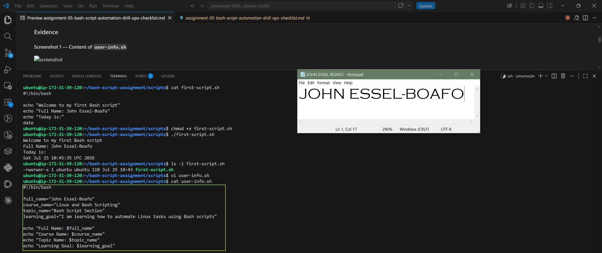

---

#### Screenshot 2 — Output of `./user-info.sh`

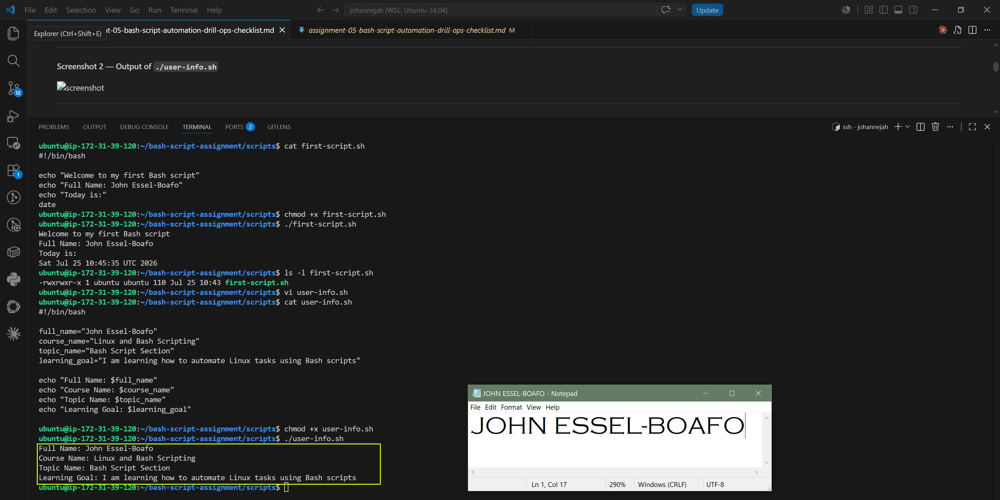

---

### Notes

Answer the following in your own words:

**1. What is a variable in Bash?**

In Bash, a variable is a temporary storage container that holds a piece of data—such as text strings, numbers, or command outputs—in the system's memory.

You assign a value to a variable using the equals sign (=), and you reference or retrieve that value later in your script by placing a dollar sign ($) in front of the variable's name. They allow you to write dynamic scripts that can reuse and change data on the fly.

---

**2. Why should we avoid spaces around the `=` sign when creating variables?**

In Bash, spaces are used as argument separators to distinguish between a command and the options passed to it.
If you add spaces around the equals sign, the system completely misinterprets your intent:
Writing NAME = John: Bash reads NAME as a core command, = as the first argument, and John as the second argument. It will search your system for a program named NAME and return a frustrating command not found error.
Writing NAME= John: Bash views NAME= as an environment override variable for a command named John.
Keeping it compressed as NAME="John" explicitly tells the interpreter: "This is a single assignment operation, store this value."

---

**3. How do you access the value stored inside a Bash variable?**

To access the value stored inside a Bash variable, you place a dollar sign ($) directly in front of the variable name.

For complex scripts or when joining a variable directly to text without a space, wrap the variable name in curly braces.

---

# Task 4 — Arrays & Loops: Tools Checklist Script

## Goal

Use arrays and loops to print a checklist of tools used in Bash scripting.

### Evidence

#### Screenshot 1 — Content of `tools-checklist.sh`

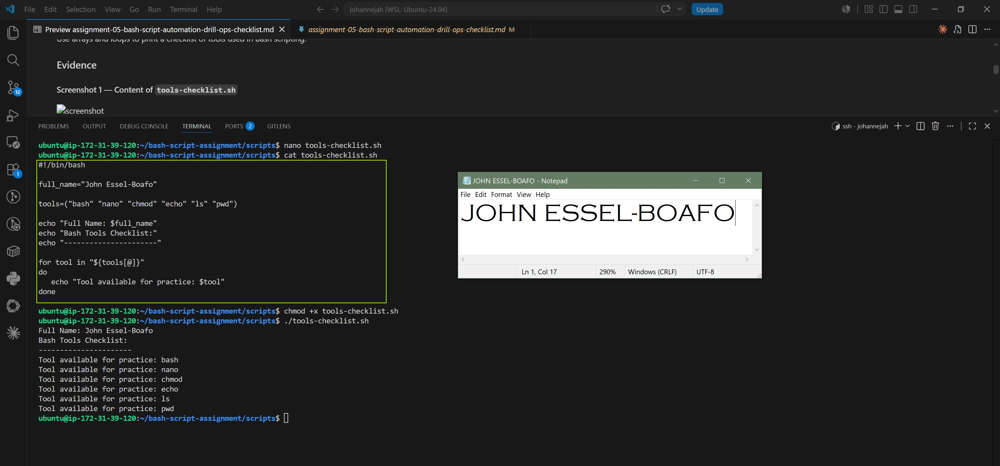

---

#### Screenshot 2 — Output of `./tools-checklist.sh`

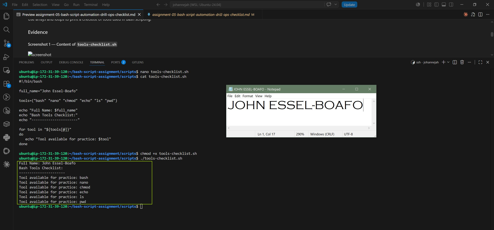

---

### Notes

Answer the following in your own words:

**1. What is an array in Bash?**

In Bash, an array is a variable that lets you store multiple pieces of data under a single name instead of creating separate variables for each item.

Think of it as a numbered list. You can store multiple strings or numbers in one place, loop through them sequentially, or pull out a specific item using its position index number (which starts at 0).

---

**2. Why are arrays useful in scripts?**

Arrays are useful in scripts because they allow you to automate repetitive tasks on a large group of items using a single block of code. Instead of writing separate commands for every individual file, folder, or server configuration, you group them together and handle them all at once.

---

**3. What does `"${tools[@]}"` mean?**

In Bash, "${tools[@]}" means "give me every single item inside the tools array, expanded perfectly as individual elements."

It is the absolute standard way to safely read or loop through all items in an array. Breaking down the components reveals how it functions:

tools: The name of your array variable.

[@]: The index key that tells Bash to look at all elements in the array instead of just a single position.

The Double Quotes "": This is the crucial part. Wrapping it in quotes ensures that if an item inside your array contains a space (like "Nginx Web Server"), Bash treats it as one single item rather than breaking it apart into separate words.

---

**4. What is the purpose of the `for` loop in this script?**

The purpose of the for loop is automation through repetition. It allows your script to take a list of items (like an array of servers, deployment tools, or directories) and execute the exact same block of code for each item in that list, one by one, until it reaches the end.

---

# Task 5 — Loops: Number Counter Script

## Goal

Use loops to repeat a task multiple times.

### Evidence

#### Screenshot 1 — Content of `counter.sh`

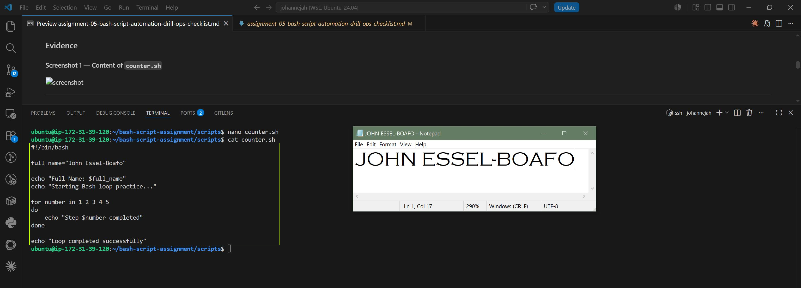

---

#### Screenshot 2 — Output of `./counter.sh`

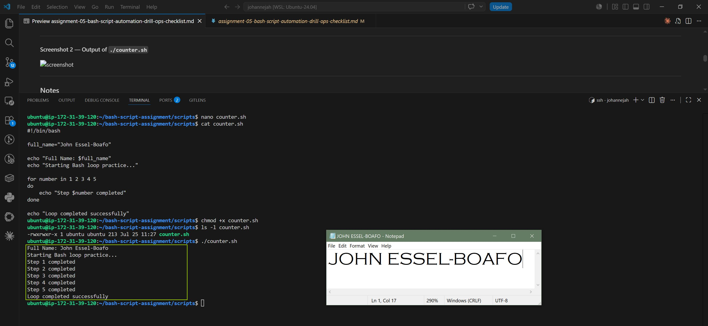

---

### Notes

Answer the following in your own words:

**1. What is a loop?**

A loop is a control structure in programming that automatically repeats a specific block of code as long as a certain condition is met or until a list of items runs out.

Instead of writing the same command over and over again, you write it once inside a loop and tell the system how many times to execute it. In system administration and DevOps, loops are the engine behind mass automation—allowing you to perform actions like creating 50 user accounts, backing up a list of databases, or checking the status of multiple servers with just a few lines of code.

---

**2. Why do we use loops in Bash scripting?**

We use loops in Bash scripting primarily for efficiency, scalability, and automation. They allow us to write a block of code once and execute it repeatedly across dozens, hundreds, or thousands of targets without manual intervention.

---

**3. How many times did the loop run in your script?**

This is because the array named tools contained 3 distinct items: "Nginx", "Docker", and "AWS CLI". The for loop is built to run exactly once for every element in the list, so it executed its code block three times before automatically stopping.

---

**4. What would you change if you wanted the loop to run 10 times?**

To make a loop run exactly 10 times, you have two great options depending on what you are trying to do: generating a sequence of numbers (best for counting), or filling an array with 10 specific items.

---

# Task 6 — Files & Conditionals: File Validation Script

## Goal

Use file checks and conditionals to verify whether files and directories exist.

### Evidence

#### Screenshot 1 — Output of `ls -lah ../test-folder`

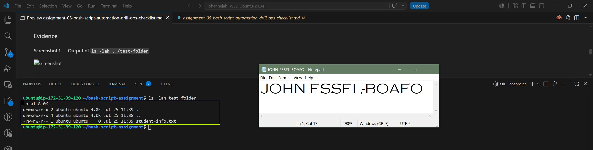

---

#### Screenshot 2 — Content of `file-check.sh`

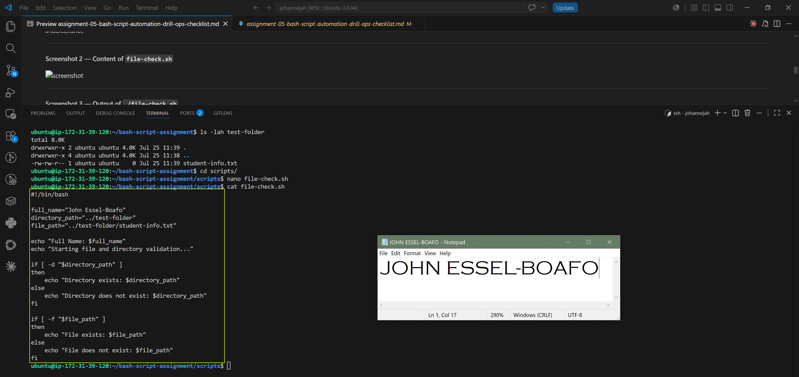

---

#### Screenshot 3 — Output of `./file-check.sh`

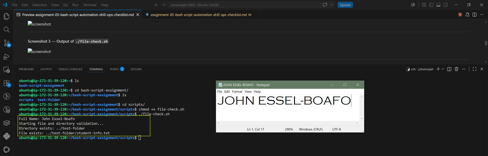

---

### Notes

Answer the following in your own words:

**1. What does `-d` check in Bash?**

In Bash, -d is a file test operator used inside conditional statements (like if statements) to check if a specific path exists and is a directory.

When you run this check, Bash looks at the filesystem and evaluates it to true only if the target path is both real and a folder, rather than a regular file, a symbolic link, or non-existent.

---

**2. What does `-f` check in Bash?**

In Bash, -f is a file test operator used inside conditional statements to check if a path exists and is a regular file (like a text file, image, or executable script). It evaluates to true only if the path exists and points to an actual file—it will return false if the path points to a folder or does not exist at all.

---

**3. Why should file and directory paths be stored in variables?**

Single Point of Update: If a directory or file path changes, you only have to update it once at the top of your script in the variable, rather than hunting through dozens of lines of code to change every hardcoded path.

Reduces Typos: Repeating long paths like /var/log/nginx/access.log manually increases the risk of a spelling mistake that could break your script.

Clean Code: Using meaningful variable names (like LOG_DIR or BACKUP_FILE) makes your code much easier to read and understand.

---

**4. What happens if the file does not exist?**

In a conditional check (if [ -f "$FILE" ]): The expression evaluates to false, and Bash skips to the else block or moves on to the next command without crashing.

In a direct read/execute command (like cat "$FILE" or source "$FILE"): Bash will throw an error message (No such file or directory) and return a non-zero exit code (an error status).

In a write/output command (like echo "data" > "$FILE"): Bash will automatically create a new file at that path (assuming the target directory exists and you have write permissions).

---

# Task 7 — Conditionals: Pass or Retry Script

## Goal

Use if-else conditionals to make decisions based on a variable value.

### Evidence

#### Screenshot 1 — Content of `score-check.sh` with `score=85`

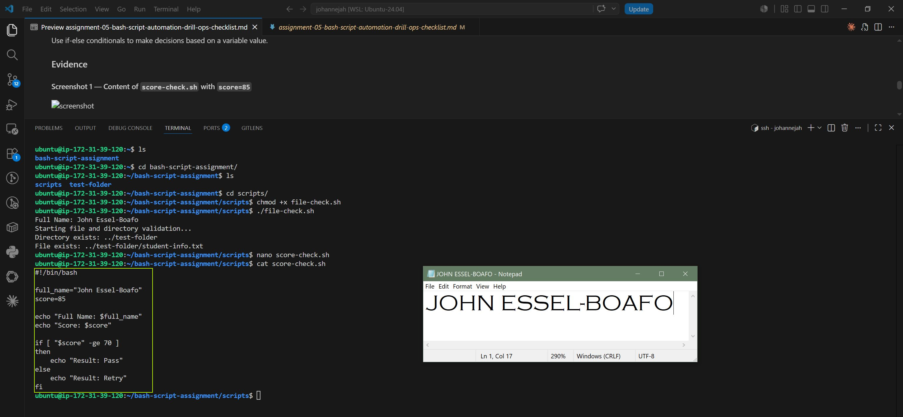

---

#### Screenshot 2 — Output showing `Result: Pass`

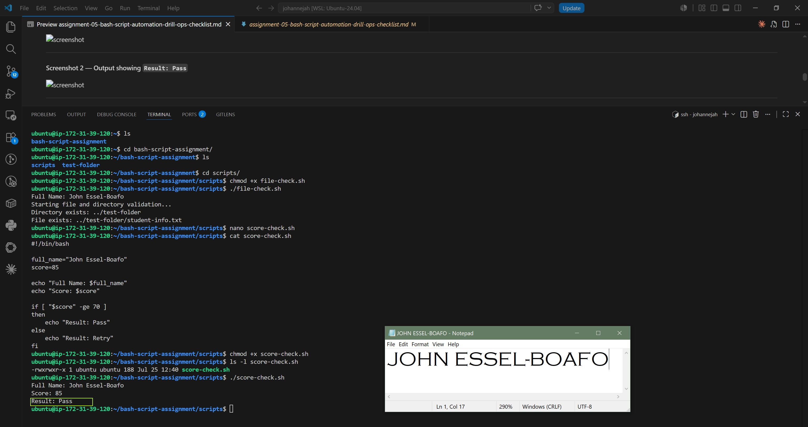

---

#### Screenshot 3 — Content of `score-check.sh` with `score=55`

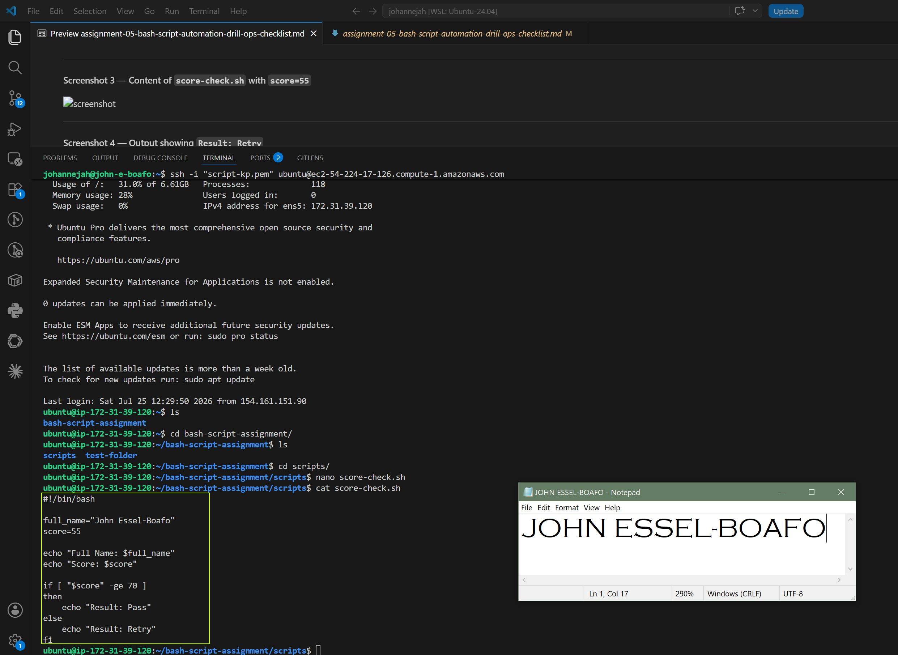

---

#### Screenshot 4 — Output showing `Result: Retry`

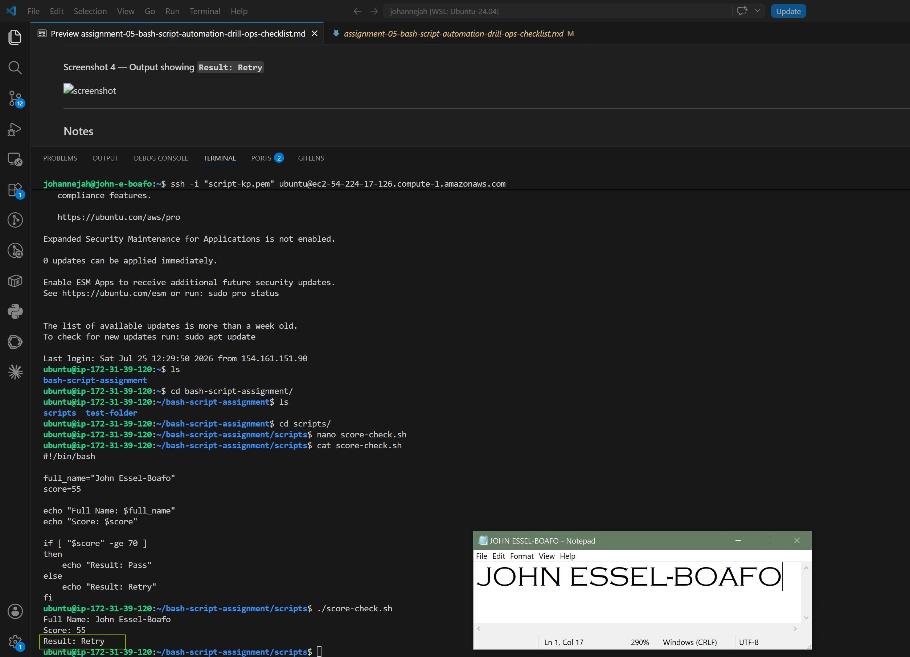

---

### Notes

Answer the following in your own words:

**1. What is the purpose of if-else in Bash?**

The main purpose of if-else is decision-making. It allows a script to evaluate a specific condition and choose different execution paths based on whether that condition turns out to be true or false.

Without if-else, a script can only run line by line blindly. With if-else, your script becomes smart enough to handle changing scenarios—for example: "If a backup directory exists, save the files there; else, log an error message and exit.

---

**2. What does `-ge` mean?**

In Bash, -ge stands for "Greater than or Equal to". It is an integer comparison operator used inside conditional statements to compare two numbers.

For example, if [ "$DISK_USAGE" -ge 90 ]; then checks if a server's disk usage is 90% or higher so the script can trigger a storage warning.

Note on Syntax: Operators like -ge, -gt, -le, and -eq are used exclusively for numerical comparisons in Bash, whereas string comparisons use symbols like >, <, or =.

---

**3. Why should conditions be tested with different values?**

Testing conditions with different input values (especially edge cases) is critical to ensure your script is resilient and bug-free.

When you write an if-else block, you are creating multiple possible paths through your code. If you only test the script with values that trigger the if branch (a "happy path"), you won't know if the else branch actually works, or if unexpected inputs will crash the script entirely. Testing high, low, equal, and invalid values guarantees the script handles real-world server environments reliably.

---

**4. How can conditionals help in automation scripts?**

Error Prevention & Pre-checks: Before attempting to install software or edit a file, a conditional verifies whether dependencies are met or if a file exists (-f).

Idempotency (Safe Re-running): They allow a script to check if a service, user, or directory is already set up (-d) so it doesn't break things by attempting to re-create them.

Self-Healing & Safeguards: They allow scripts to take automated corrective actions—such as restarting an Nginx service if a health check fails, or clearing logs if disk space drops too low.

Flow Control: They let a script route execution based on dynamic inputs, such as taking different actions depending on whether the script is running in a development or production environment.

---

# Task 8 — Functions: Final Bash Automation Script

## Goal

Create a final Bash script using functions to organize reusable code.

### Evidence

#### Screenshot 1 — Content of `final-automation.sh`

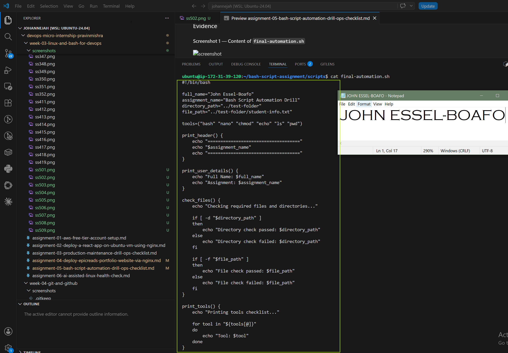

---

#### Screenshot 2 — Output of `./final-automation.sh`

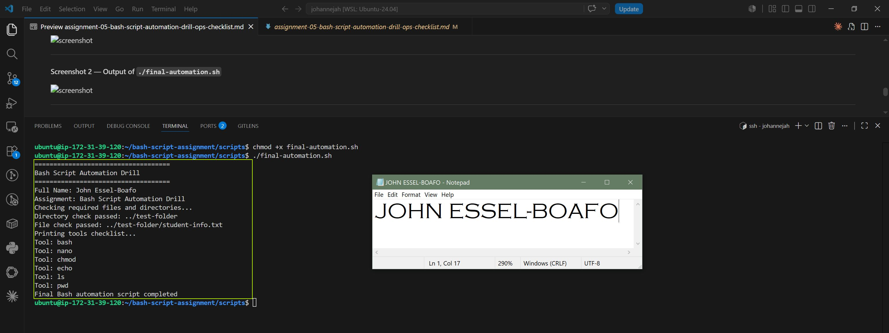

---

#### Screenshot 3 — Output of `ls -lah` showing all created scripts

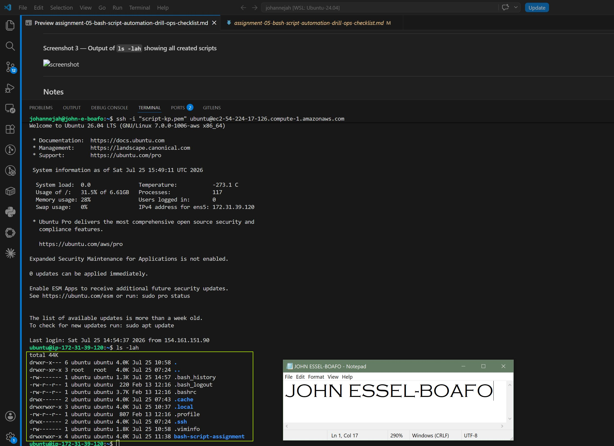

---

### Notes

Answer the following in your own words:

**1. What is a function in Bash?**

A function in Bash is a reusable block of code designed to perform a specific task. Think of it as a sub-script inside your script. Once you define a function by giving it a name, you can execute all the commands inside it anytime by calling its name.

---

**2. Why are functions useful in scripts?**

Functions are essential for writing clean, professional automation scripts because they bring three major advantages:

Code Reusability: Instead of copying and pasting the exact same block of code 10 times throughout a script, you write it once in a function and call it whenever needed.

Easier Debugging & Maintenance: If a specific task breaks or needs an update, you only have to fix the code in one place (inside the function) rather than searching through hundreds of lines of code.

Readability: Functions allow you to break a long, complex script into smaller, logical chunks. Your main script execution becomes easy to read, looking almost like plain English (e.g., check_network, backup_database, send_alert).

---

**3. Which functions did you create in this script?**

I created four functions:
print_header prints the assignment header.
print_user_details prints my full name and the assignment name.
check_files checks whether the required directory and file exist.
print_tools uses a loop to print each tool stored in the array.

---

**4. How does this final script combine variables, arrays, loops, conditionals, files, and functions?**

The script uses variables to store my name, the assignment name, and the required paths. It uses an array to store the tool names and a loop to print them one by one.
It uses if-else conditionals with -d and -f to check the required directory and file. Finally, the related commands are organized into functions, and those functions are called in the correct order to run the complete automation script.

---

# LinkedIn Post (Required)

## Evidence

#### LinkedIn Post URL

Paste your LinkedIn post URL here:

https://www.linkedin.com/posts/john-essel-boafo-4ab79555_week-3-of-dmi-cohort-3-linux-bash-scripting-share-7486897099549233153-kDZw/?utm_source=share&utm_medium=member_desktop&rcm=ACoAAAuvIYMB9Ryolxl8KsPVg0BaN-tpeQW214U

---

#### Screenshot — Published LinkedIn post

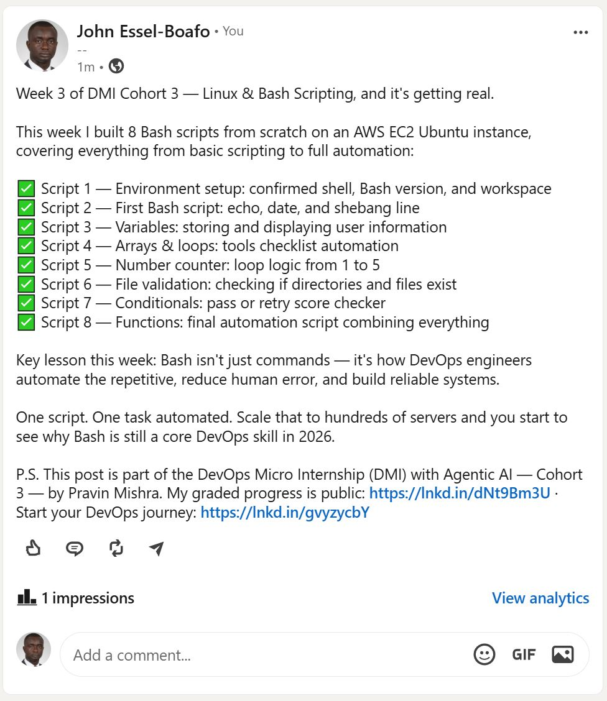

---

# Submission Instructions

- Add all required screenshots in your submission
- Full name must be visible in required screenshots
- All script files must be created and run successfully
- Required notes must be answered clearly for every task
- Do not expose sensitive information (keys, passwords, credentials)

---

# Completion Checklist

- [ ] Task 1: Environment setup verified, workspace created (Screenshots 1–2, Notes answered)
- [ ] Task 2: First script created, executed, permissions verified (Screenshots 1–3, Notes answered)
- [ ] Task 3: Variables script created and run (Screenshots 1–2, Notes answered)
- [ ] Task 4: Arrays and loops script created and run (Screenshots 1–2, Notes answered)
- [ ] Task 5: Counter loop script created and run (Screenshots 1–2, Notes answered)
- [ ] Task 6: File validation script created and run (Screenshots 1–3, Notes answered)
- [ ] Task 7: Pass/Retry conditional script tested with both values (Screenshots 1–4, Notes answered)
- [ ] Task 8: Final automation script created and run (Screenshots 1–3, Notes answered)
- [ ] All scripts run without errors
- [ ] Full Name visible in all required screenshots
- [ ] LinkedIn post published and URL submitted
- [ ] No sensitive data exposed

---

## 📌 About DMI & CloudAdvisory

DevOps Micro Internship (DMI) is a project-based DevOps program run by Pravin Mishra (The CloudAdvisory) focused on real-world execution, systems thinking, and career readiness.

It helps learners build strong DevOps foundations with hands-on experience.

---

## 📌 Resources

- 🌐 DMI Official Website: https://pravinmishra.com/dmi  
- 🎓 DevOps for Beginners (Udemy): https://www.udemy.com/course/devops-for-beginners-docker-k8s-cloud-cicd-4-projects/  
- 🎓 Agentic AI DevOps with Claude Code: https://www.udemy.com/course/ultimate-agentic-ai-devops-with-claude-code/  
- 🎓 DevOps with Claude Code: Terraform, EKS, ArgoCD & Helm: https://www.udemy.com/course/devops-with-claude-code-terraform-eks-argocd-helm/  
- ▶️ YouTube Playlist: https://www.youtube.com/playlist?list=PLFeSNDtI4Cho  
- 🔗 Pravin Mishra (LinkedIn): https://www.linkedin.com/in/pravin-mishra-aws-trainer/  
- 🏢 CloudAdvisory (LinkedIn): https://www.linkedin.com/company/thecloudadvisory/

---

*This submission is part of DevOps Micro Internship (DMI) Cohort 3 — Agentic AI Track.*