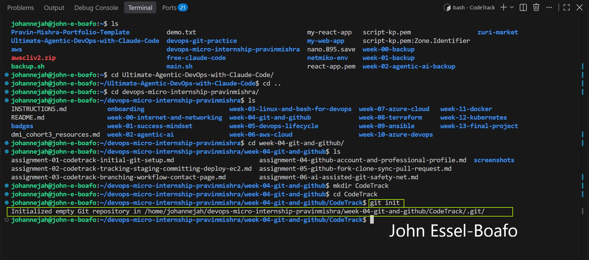
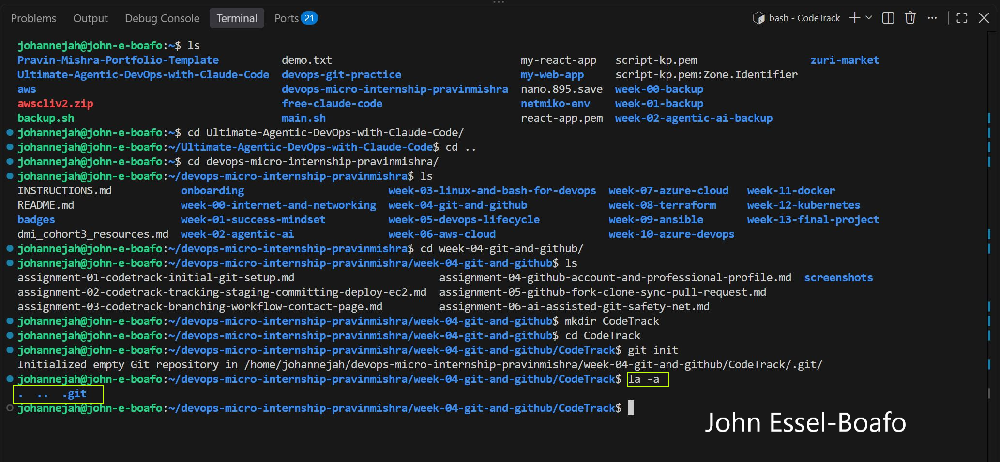
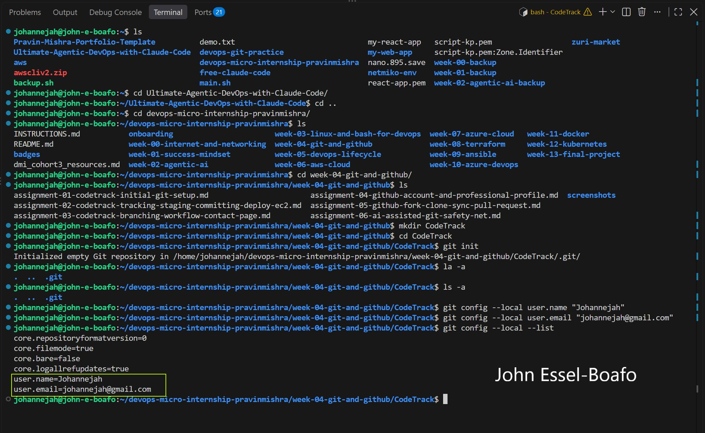
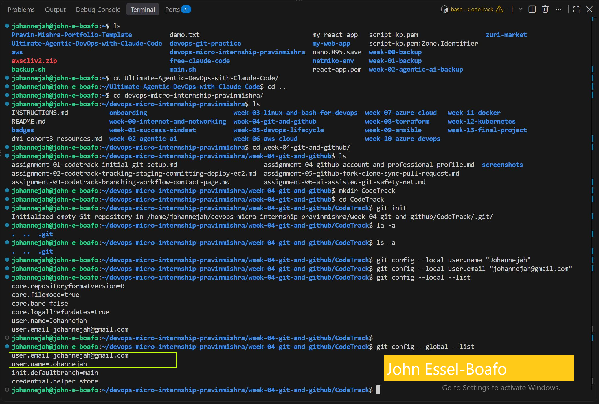

# Assignment 1 — CodeTrack: Initial Git Setup (Local Only)

Part of the DevOps Micro Internship (DMI) Cohort 3 with Agentic AI

---

## Purpose

In this assignment, you will set up Git correctly on your local machine before starting the CodeTrack project. You will create a local repository and configure your Git identity at both the repository level (local) and the machine level (global). This assignment is local only — you will not push anything to GitHub yet.

---

# Task 1 — Create the CodeTrack Project and Initialize Git

## Goal

Create a `CodeTrack` project folder and initialize it as a Git repository.

### Evidence

#### Screenshot 1 — Output of `git init` inside `CodeTrack` showing "Initialized empty Git repository"

---

#### Screenshot 2 — Output of `ls -a` showing the `.git` folder

---

### Notes

**1. What is the `.git` folder, and why does it matter?**

The .git folder is a hidden directory created at the root of a project repository whenever you run git init or clone a repository with git clone.

It serves as the brain and database of Git for that repository. It contains all the metadata, history, configurations, and tracking information that Git needs to manage your project's version control.

Why It Matters
Self-Contained Architecture: Because everything is stored locally inside .git, Git operates completely offline. You don't need a connection to GitHub or a central server to view commit logs, view diffs, or create branches.

Deleting It Destroys Local History: If you delete the .git folder, your project files remain intact, but it ceases to be a Git repository. You instantly lose all local version history, branches, stashes, and commit tracking.

Security Risks (Exposing .git Online): If you accidentally deploy the .git folder to a live web server (e.g., in a public web root), attackers can download it and extract your source code, historic commits, and potentially hardcoded secrets or environment credentials.
---

# Task 2 — Configure Git Identity Locally (Repository-Only)

## Goal

Set your Git username and email for the `CodeTrack` repository only, using `git config --local`.

### Evidence

#### Screenshot 3 — Output of `git config --local --list` showing your `user.name` and `user.email`

---

# Task 3 — Configure Git Identity Globally

## Goal

Set a global Git username and email for this machine using `git config --global`. Note that CodeTrack's local settings still take priority over these.

### Evidence

#### Screenshot 4 — Output of `git config --global --list` showing your `user.name` and `user.email`

---

# Submission Instructions

- Add all required screenshots in your submission
- Full Name must be visible in required screenshots
- Do not expose passwords, access tokens, or private keys

---

# Completion Checklist

- [ ] `CodeTrack` folder created and initialized as a Git repository (Screenshots 1–2)
- [ ] Explanation of the `.git` folder written in your own words
- [ ] Local `user.name` and `user.email` configured and verified (Screenshot 3)
- [ ] Global `user.name` and `user.email` configured and verified (Screenshot 4)
- [ ] No sensitive data exposed

---

## 📌 About DMI & CloudAdvisory

DevOps Micro Internship (DMI) is a project-based DevOps program run by Pravin Mishra (The CloudAdvisory) focused on real-world execution, systems thinking, and career readiness.

It helps learners build strong DevOps foundations with hands-on experience.

---

## 📌 Resources

- 🌐 DMI Official Website: https://dmi.pravinmishra.com?utm_source=github&utm_medium=readme  
- 🎓 University: https://university.pravinmishra.com?utm_source=github&utm_medium=readme  
- 💬 Discord Community: https://discord.pravinmishra.com?utm_source=github&utm_medium=readme  
- 📝 Blog: https://dmi.pravinmishra.com/blog?utm_source=github&utm_medium=readme  
- ▶️ YouTube Playlist: https://www.youtube.com/playlist?list=PLFeSNDtI4Cho  
- 🔗 Pravin Mishra (LinkedIn): https://www.linkedin.com/in/pravin-mishra-aws-trainer/  
- 🏢 CloudAdvisory (LinkedIn): https://www.linkedin.com/company/thecloudadvisory/

---

*This submission is part of DevOps Micro Internship (DMI) Cohort 3 — Agentic AI Track.*
